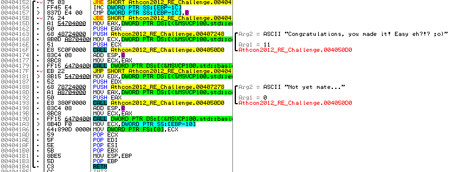
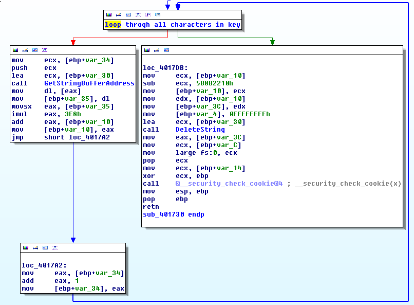
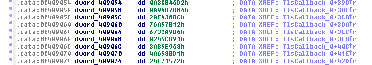
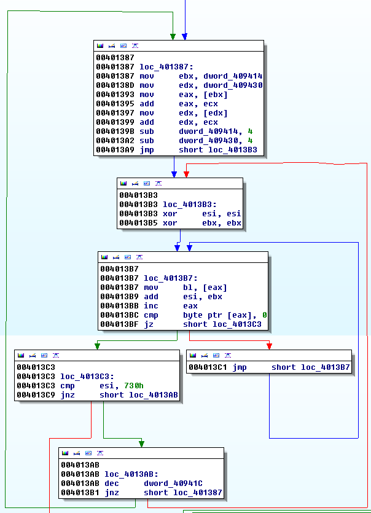

Solution for the Athcon 2012 Reverse Engineering Challenge
==========================================================

Original release date: 2012-01-10 04:39:24

.intro
------

When I found the [Athcon 2012 Reverse Engineering Challenge](http://athcon.org), I realized that I didn't solve any crackmes since crackmes.de is down, so I decided to take a look at this one. I definitely did not regret the decision, it was a fun to do this. Since the game is over, and the challenge has a winner, I can share my solution.

The README says that the crackme is only compatible with Windows7 x86\. Since Win7 has ASLR which can be a pain in the ass during reversing, as the first step of solving this challenge I installed the Enhanced Mitigation Experience Toolkit (LINK) and turned ASLR off.

.{bad,good}boy
--------------

Than I started the crackme and gave it a bogus key. The message I got was "Not yet mate!". Searched for this string in OllyDbg, and I found it at near the end of a rather lengthy function spanning from 0x00401820 to 0x004041b4.



As you can see on the picture, the goodboy message is there too. So I put a breakpoint at the beginning of this function and started single-stepping it. Meanwhile I hoped that I don't actually have to single-step that whole lot of instructions :D

.keygen (nope, not THE keygen)
------------------------------

There is a function call at 0x0040185a. When I tried to step through it, the program started running. I put a bp right after the funtion call, and looked at the program’s window. It was asking for the key. So I figured that the key input algo must be in that function. And indeed it was. The function calculates a value from the key with the following algo:



The function loops through all the characters of the key, multiplies their ASCII value by 0x3e8 (1000 in decimal), and adds these values to the initial value, 1\. So the value generation algo can be described with this pseudo-code:

```
KEYVAL = 1;
foreach (char c in KEY) {
  KEYVAL += ASCII(c) * 0x3e8;
}
```

0x5b8b2210 is then subtracted from KEYVAL, and the result is the return value of the function.

.bigmessystuff
--------------

OK, lets get back to the large function! At first sight it really looked like a mess, but after single-stepping the first few dozen instructions it all became clear. The code is a self-modifying code that works something like this:

Bytes from a memory region are read into a register, and somehow modified. The modification can be the addition or subtraction of a constant, bitwise “and” with a constant, etc. Then the modified value (a byte or word) is written back to the memory region. There are a few instructions that are modified this way, and some of the instructions are modified more than one time. I searched the disassembly for "mov word ptr ds:" and "mov byte ptr ds:" instructions, which gave me a list of the addresses where the code was modified, so I knew where the "interesting" instructions are. I put a breakpoint immediately before these instructions (could not bp the actual instructions since they are modified during execution); this way it was very easy to follow the execution flow. Here is a list of those breakpoints:

```
00401980 00402357 00402D26 004035C0 004039BE 004021A1
00401B1E 0040255A 00402FA3 0040362C 00403C46 00402C59
00401E84 0040270C 0040313A 004036D5 00403D05 0040348A
00402072 004029EE 004033E3 004038D3 00403E52 00403938
00403FB8 0040414D
```

This is what happening inside that function: SKEYVAL (which is equal to KEYVAL - 0x5b8b2210) is XORed with 8 DWORD constants located at 0x00409054 - 0x00409074.



After the XORing the result is compared to the 9th constant in that array. If they are equal, we jump to the goodbay, if not, we jump to the badboy. Easy, eh? :)

So, basically we have the following equation:

```
SKEYVAL XOR
0x0A3CB46D2 XOR
0x0A94B7D84 XOR
0x28E436BC XOR
0x76A57B12 XOR
0x6732A9B6 XOR
0x8245CD91 XOR
0x3AB5E968 XOR
0x4A653BD1 = 0x24E71572
```

Which means:

```
SKEYVAL XOR
0x0A3CB46D2 XOR
0x0A94B7D84 XOR
0x28E436BC XOR
0x76A57B12 XOR
0x6732A9B6 XOR
0x8245CD91 XOR
0x3AB5E968 XOR
0x4A653BD1 XOR
0x24E71572 = 0
```

Which means:

```
SKEYVAL XOR 0xe581d514 = 0
```

So SKEYVAL has to be 0xe581d514, therefore KEYVAL has to be 0xe581d514 + 0x5b8b2210 = 0x410CF724 ( = 1091368740 in decimal).

After thinking about this a bit, it is clear, that no string exist that would generate this KEYVAL. KEYVAL must be x * 1000 + 1, and this number is clearly not in that form (Actually, because of the overflows, it is possible that a “good” number has a different form, but that would mean an insanely large key string). Bummer. There must be some anti-debug stuff going on here, so lets check for those!

.antirce
--------

One way to implement some "invisible" anti-rce protection is to put some debugger-checking algo into a TLS callback function. These functions run every time a thread starts or exits. The cool thing is that they run before the execution reaches the entry point, so a beginner reverser can easily miss them.

This crackme does have a TLS directory, and there is a TLS callback function defined. IDA Pro recognizes these functions, and marks them as entry points, so they are easily accessible with the CTRL-E combo. OllyDbg 2.0 (not sure of 1.1) recognizes TLS callbacks too, and can break on them instead of the EP.

So, I analyzed the TLS callback (located at 0x00401290), and found some anti-rce goodies there :) The first was a call to OutputDebugStringA. The API is not called directly, so I did not see the name in the "Intermodular calls" window in Olly. Its address is calculated, and put into ECX with this algo:



There are more than one ways to use this function for anti-rce purposes, one of them is the following: if the function is called from a debugger, the EAX register's value will be a valid address from the process's address space. If the function is called when no debugger is attached, the EAX value will be 0 (at least on Windows 7).

This crackme checks the EAX value by using it as a pointer, and dereferencing it. Inside a debugger nothing will happen (the address is valid), outside of it an exception will be raised (since 0 is not a valid pointer), and a custom exception handler (located at 0x00401411) will run. Knowing this I just had to break on the dereferencing (at 0x004013e8), and change EAX's value to 0.

So, the exception fired, and I was in the exception handler routine. At 0x00401444 a pointer into the process heap is dereferenced, and its value is put into EBX. This value was a suspicious one, 0xABABABAB. When running inside a debugger, allocating/freeing heap memory don't quite work like outside a debugger. One of these differences is that uninitialized or freed heap memory gets these strange values (based on their role), like the above, or 0xDEADBEEF, 0xFDFDFDFD, etc.. You can find a pretty good article about this behaviour on this link: [Unusual memory bit patterns](http://www.softwareverify.com/memory-bit-patterns.php)

Running outside the debugger, this 0xABABABAB would be 0x00000000\. This is important, since this value is added to another value, and the result is used as a pointer. Adding 0xABABABAB corrupts the otherwise good value, and when the pointer is dereferenced, an exception will occur. Which is, in this case is not the desired path. So I put a breakpoint at 0x0040143c, too, and changed the 0xABABABAB to 0\. So far, two anti-debug tricks are discovered and beaten!!

After this the execution continues, and the address of two APIs (VirtualProtect and VirtualAlloc) are obtained with a method similar to the above mentioned one, which was used to get the address of OutputDebugStringA. This algo is located at 0x00401532\. These two APIs are used for a few things:

 - A few bytes are marked as rw and executable with VirtualProtect somewhere inside kernel32 (0x77e2ed5f) and the following instructions are written there:

```
MOV DWORD PTR DS:[Athcon2012_RE_Challenge.409438],409054
NOP
CALL EDX
```

    Remember, 0x00409438 is the address from the address of the XORed values comes from! Since this may be interesting, I put a bp at 0x77e2ed5f.
 - A chunk of memory is allocated with VirtualAlloc. The allocated memory's address is stored at 0x00409438 and 0x0040943c. Also, 0xc0000005 (the value of an Access Violation Error :) ) is added to the 9 DWORDs located at 0x00409054, and the results are stored at this allocated memory.
 - This page is than marked as a guard page with VirtualProtect.

I continued the execution and breaked inside kernel32 on those few instruction that were written there by the program. I continued the execution again.

The breakpoint at the beginning of the well known lengthy, obfuscated function hit. So I was no longer on uncharted territory, I knew this function too well. Yeah :) But it could surprise me again!! Because of the previously allocated memory area (where the 9 "good" DWORDs were stored) was marked as a guard page, when the address is first accessed at 0x00401981, an exception occurs. So the JMP at 0x0040198a is never reached. Instead, another custom exception handler is executed, which is located at 0x00401995.

.xoring (hope its an X, not a B)
--------------------------------

From this point on there were really no surprises. I just had to XOR that 9 DWORDs, add 0x5b8b2210 to it, and I had KEYVAL:

```
63cb46d7 -\\
694b7d89  |
e8e436c1  |
36a57b17  |
2732a9bb   > XOR-ed together : 0xa581d569
4245cd96  |
fab5e96d  |
0a653bd6  |
e4e71577-/

0xa581d569 + 0x5b8b2210 = 0x10cf779 ( = 17627001 in decimal)
```

And, yeah, this number looks good, it is clearly x * 1000 + 1\. So, KEYVAL is 17627001\. This means, that the ASCII sum of a good key's characters has to be 17627\. I did not write a keygen, but the following is an example of a good key:

```
zzzzzzzzzzzzzzzzzzzzzzzzzzzzzzzzzzzzzzzzzzzzzzzzzzzzzzzzzzz
zzzzzzzzzzzzzzzzzzzzzzzzzzzzzzzzzzzzzzzzzzzzzzzzzzzzzzzzzzz
zzzzzzzzzzzzzzzzzzzzzzzzzz;
```

Yepp, that is 144 'z' and 1 ';'.

.theend
-------

So, this is it. I hope you enjoyed this tut (or at least not bored to death), and maybe you learned something while reading it. If something is not clear, feel free to contact me at sghctoma at gmail dot com!

And many thanks to the author of the challenge, this was fun!
