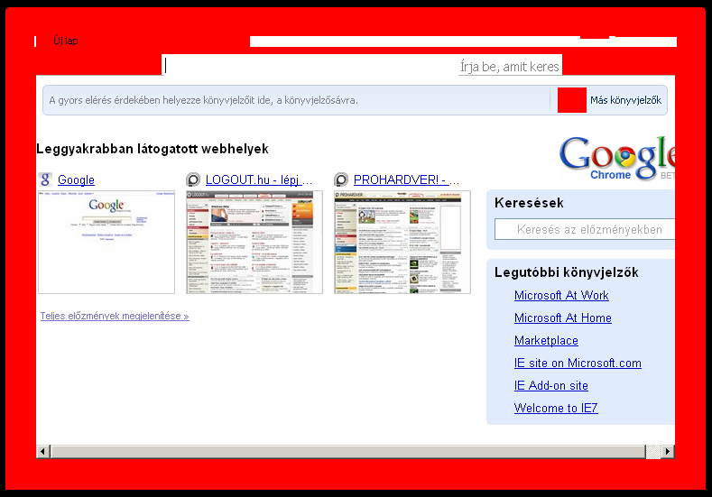
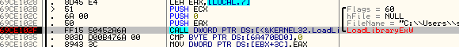
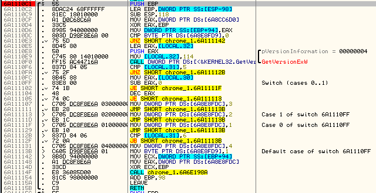
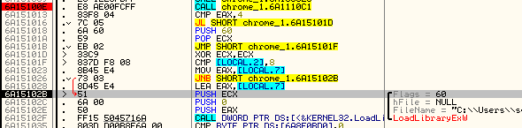
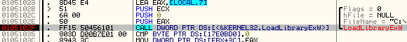

Google Chrome and the executable Themes
=======================================

Original release date: 2008-09-26 18:48:33

Maybe a week ago I was examining Google's brand new browser, Chrome. When I have realized, that inside the Themes folder, there is only a dll file, my first thought was, that it could be something nasty. Why is that? If the loading of the dll is screwed up, an innocent-looking theme file could run dangerous code. I've written a simple dll, that does nothing else, than ~~firing up Notepad.exe~~ pops up a MessageBox when the dll is loaded (DLL_PROCESS_ATTACH). I swapped the original theme file with [this dll](downloads/dll_wo_resources.dll). I started Chrome, and ~~Notepad started~~ the MessageBox appeared. Chrome did not shut down, but it looked weird:

Today I had the time to take a deeper look inside the problem. My plan was to make a dll, that contains some executable code, and doesn't screw up the theme. Solution is simple: grab the resources from the original dll, and put them inside [our own dll](downloads/dll_w_resources.dll). I did it, and it worked. On XP. On Vista, it did not.

What can be the difference? First a minimal intro about dlls. A dll usually has a [DllMain function](http://msdn.microsoft.com/en-us/library/ms682583.aspx), that is called when one of these four events occur: the dll is being loaded/unloaded, or the current process opens or closes a thread. The point is, that it is possible to write a dll, that executes some code when it is loaded.

There are dlls without entry point [resource only dll](http://msdn.microsoft.com/en-us/library/8ys34d7t(VS.71).aspx)); in fact, the theme file of Chrome is such a dll, too. I have swapped this to a dll, that has an entry point, and when the dll loaded, the code ran.

There is a way to prevent the execution of the DllMain function, even if the dll has one. One can use the [LoadLibraryEx](http://msdn.microsoft.com/en-us/library/ms684179(VS.85).aspx) API to do this. In fact, Chrome's chrome.dll does this on Vista. It loads default.dll (the theme file) with LoadLibraryEx, using 0x60 (LOAD_LIBRARY_AS_DATAFILE_EXCLUSIVE | LOAD_LIBRARY_AS_IMAGE_RESOURCE) as the third parameter.

And here comes the problem. These two flags are only available on Vista. Chrome has a function, that returns 1, 2 or 3 for a 5.x version OS, and 4 for a 6.x version OS.

If this value is 4, Chrome calls LoadLibraryEx using 0x60 as third parameter. If it is not 4, the browser calls the API with 0x00.

With 0x00, LoadLibraryEx is practically identical to the plain simple [LoadLibrary](http://msdn.microsoft.com/en-us/library/ms684175(VS.85).aspx). That's why code execution works on XP, and does not work on Vista.

Calling LoadLibraryEx with 0x00 on XP is a pretty dumb thing from Google, since there is a LOAD_LIBRARY_AS_DATAFILE (0x02) flag. It provides less security than LOAD_LIBRARY_AS_DATAFILE_EXCLUSIVE, but the execution of the DllMain function can be prevented by using this flag.

So, I think, one should be careful with downloadable Chrome themes, they can contain malicious code. Oh, and one more thing: I am not a mazochist. I did this examination in OllyDbg, because there is no internet connection on the train, so I could not download the source code of Chrome :)
