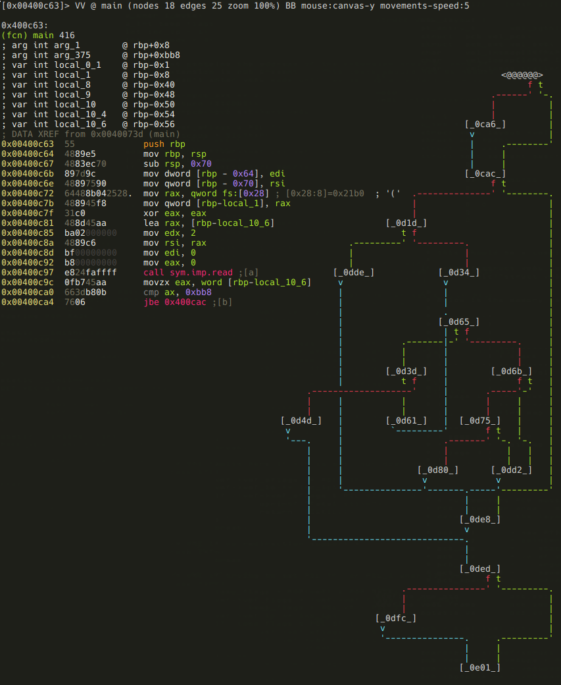

Solving avatao's "R3v3rs3 4"
===========================

.intro
------

After a few years of missing out on wargames at Hacktivity, this year I've
finally found the time to begin, and almost finish (yeah, I'm quite embarrassed
about that unfinished webhack :) ) one of them. There were 3 different games at
the conf, and I've chosen the one that was provided by
[avatao](https://avatao.com). It consisted of 8 challenges, most of them being
basic web hacking stuff, one sandbox escape, one simple buffer overflow
exploitation, and there were two reverse engineering exercises too.  You can
find these challenges on https://platform.avatao.com.

.radare2
--------

I've decided to solve the reversing challenges using
[radare2](http://www.radare.org/r/), a free and open source reverse engineering
framework. I have first learned about r2 back in 2011 during a huge project,
where I had to reverse a massive, 11MB statically linked ELF. I simply needed
something that I could easily patch Linux ELFs with.  Granted, back then I've
used r2 alongside IDA, and only for smaller tasks, but I loved the whole concept
at first sight. Since then, radare2 evolved a lot, and I was planning for some
time now to solve some crackmes with the framework, and write writeups about
them. Well, this CTF gave me the perfect opportunity :)

Because this writeup aims to show some of r2's features besides how the crackmes
can be solved, I will explain every r2 command I use in blockquote paragraphs
like this one:

> ***r2 tip***: always use ? or -h to get more information!

If you know r2, and just interested in the crackme, feel free to skip those
parts!

A few advice if you are interested in learning radare2 (and frankly, if you are
into RE, you should be interested in learning r2 :) ):

The framework has a lot of supplementary executables and a shitload of
functionality - and they are very well documented. I encourage you to read the
available docs, and use the built-in help (by appending a ? to any command)
extensively! E.g.:

```
[0x00000000]> ?
Usage: [.][times][cmd][~grep][@[@iter]addr!size][|>pipe] ; ...
Append '?' to any char command to get detailed help
Prefix with number to repeat command N times (f.ex: 3x)
|%var =valueAlias for 'env' command
| *off[=[0x]value]     Pointer read/write data/values (see ?v, wx, wv)
| (macro arg0 arg1)    Manage scripting macros
| .[-|(m)|f|!sh|cmd]   Define macro or load r2, cparse or rlang file
| = [cmd]              Run this command via rap://
| /                    Search for bytes, regexps, patterns, ..
| ! [cmd]              Run given command as in system(3)
| # [algo] [len]       Calculate hash checksum of current block
| #!lang [..]          Hashbang to run an rlang script
| a                    Perform analysis of code
| b                    Get or change block size

...

[0x00000000]> a?
|Usage: a[abdefFghoprxstc] [...]
| ab [hexpairs]     analyze bytes
| aa                analyze all (fcns + bbs) (aa0 to avoid sub renaming)
| ac [cycles]       analyze which op could be executed in [cycles]
| ad                analyze data trampoline (wip)
| ad [from] [to]    analyze data pointers to (from-to)
| ae [expr]         analyze opcode eval expression (see ao)
| af[rnbcsl?+-*]    analyze Functions
| aF                same as above, but using anal.depth=1

...
```

Also, the project is under heavy development, there is no day
without commits to the GitHub repo. So, as the readme says, you should always
use the git version!
Some highly recommended reading materials:

- [Cheatsheet by pwntester](https://github.com/pwntester/cheatsheets/blob/master/radare2.md)
- [Radare2 Book](https://www.gitbook.com/book/radare/radare2book/details)
- [Radare2 Blog](http://radare.today)
- [Radare2 Wiki](https://github.com/radare/radare2/wiki)

.first_steps
------------

OK, enough of praising r2, lets start reversing this stuff. First, you have to
know your enemy:

```
[0x00 avatao]$ rabin2 -I reverse4
pic      false
canary   true
nx       true
crypto   false
va       true
intrp    /lib64/ld-linux-x86-64.so.2
bintype  elf
class    ELF64
lang     c
arch     x86
bits     64
machine  AMD x86-64 architecture
os       linux
subsys   linux
endian   little
stripped true
static   false
linenum  false
lsyms    false
relocs   false
rpath    NONE
binsz    8620
```

> ***r2 tip***: rabin2 is one of the handy tools that come with radare2. It can
> be used to extract information (imports, symbols, libraries, etc.) about
> binary executables. As always, check the help (rabin2 -h)!

So, its a dynamically linked, stripped, 64bit Linux executable - nothing fancy
here. Let's try to run it:

```
[0x00 avatao]$ ./reverse4
?
Size of data: 2623
pamparam
Wrong!

[0x00 avatao]$ "\x01\x00\x00\x00" | ./reverse4
Size of data: 1
```

OK, so it reads a number as a size from the standard output first, than reads
further, probably "size" bytes, or characters, or something like that, processes
this input, and outputs either "Wrong!", nothingm or something else, presumably
our flag. But do not waste any more time monkeyfuzzing the executable, let's fire
up r2, because in asm we trust!

```
[0x00 avatao]$ r2 -A reverse4
 -- Heisenbug: A bug that disappears or alters its behavior when one attempts to probe or isolate it.
[0x00400720]>
```

> ***r2 tip***: The -A switch runs *aa* command at start to analyze all
> referenced code, so we will have functions, strings, XREFS, etc. right at the
> beginning. You can also put *e file.analyze* into your .radare2rc, so that all
> opened executables will be analyzed. As usual, you can get help with *?*.

It is a good practice to create a project, so we can save our progress, and we
can come back at a later time:

```
[0x00400720]> Ps avatao_reverse4
avatao_reverse4
[0x00400720]>
```

> ***r2 tip***: You can save a project using Ps [file], and load one using Po [file].
> With the -p option, you can load a project when starting r2.

We can list all the strings r2 found:

```
[0x00400720]> fs strings
[0x00400720]> f
0x00400e98 7 str.Wrong_
0x00400e9f 27 str.We_are_in_the_outer_space_
0x00400f80 18 str.Size_of_data:__u_n
0x00400f92 23 str.Such_VM__MuCH_reV3rse_
0x00400fa9 16 str.Use_everything_
0x00400fbb 9 str.flag.txt
0x00400fc7 26 str.You_won__The_flag_is:__s_n
0x00400fe1 21 str.Your_getting_closer_
[0x00400720]>
```

> ***r2 tip***: r2 puts so called flags on important/interesting offsets, and
> organizes these flags into flagspaces (strings, functions, symbols, etc.) You
> can list all flagspaces using *fs*. You can also print all flags with *f*, or
> you can switch flagspaces with *fs [flagspace]*, and print just the flags in
> the current flag space.

OK, the strings looks interesting, especially the one at 0x00400f92. It seems to
hint that this crackme is based on a virtual machine. Keep that in mind!

These stringst could be a good starting point if we were talking about a
real-life application with many-many features. But we are talking about a
crackme, and they tend to be small and simple, and focused around the problem to
be solved. So I usually just take a look at the entry point(s) and see if I can
figure out something from there. Nevertheless, I'll show you how to find where
these strings are used:

```
[0x00400720]> axt @@=`f~[0]`
d 0x400cb5 mov edi, str.Size_of_data:__u_n
d 0x400d1d mov esi, str.Such_VM__MuCH_reV3rse_
d 0x400d4d mov edi, str.Use_everything_
d 0x400d85 mov edi, str.flag.txt
d 0x400db4 mov edi, str.You_won__The_flag_is:__s_n
d 0x400dd2 mov edi, str.Your_getting_closer_
```

> ***r2 tip***: We can list crossreferences to addresses using the *axt [addr]*
> command (similarly, we can use *axf [addr]* to list references from address).
> The *@@* is an iterator, it just runs the command with the arguments listed.
> The argument list in this case comes from the command *f~[0]*. It lists the
> strings from the executable with *f*, and uses the internal grep command *~*
> to select only the first column (*[0]*) that contains the strings' addresses.

.main
-----

As I was saying, I usually take a look at the entry point, so let's just do
that:

```
[0x00400720]> s main
[0x00400c63]>
```

> ***r2 tip***: You can go to any offset, flag, expression, etc. in the
> executable using the *s* command (seek). You can use references, like *$$*
> (current offset), you can undo (*s-*) or redo (*s+*) seeks, search strings
> (*s/ [string]*) or hex values (*s/x 4142*), and a lot of other useful stuff.
> Make sure to check out *s?*!

Now that we are at the beginning of the main function, we could use *p* to show
a disassembly (*pd*, *pdf*), but r2 can do something much cooler: it has a
visual mode, and it can display graphs similar to IDA, but way cooler, since
they are ASCII-art graphs :)

It also has a minimap view which is incredibly useful for getting an overall
look at a function:



> ***r2 tip***: With command *V* you can enter the so-called visual mode, which
> has several views. You can switch between them using *p* and *P*. The graph
> view can be displayed by hitting *V* in visual mode (or using *VV* at the
> prompt). Hitting *p* in graph view will bring up the minimap. It displays the
> basic blocks and the connections between them in the current function, and it
> also shows the disassembly of the currently selected block (marked wit @@@@@
> on the minimap). You can select the next or the previous block using the
> *<TAB>* and the *<SHIFT><TAB>* keys respectively. You can also select the true
> or the false branches using the *t* and the *f* keys.
> It is possible to bring up the prompt in visual mode using the *:* key, and
> you can use *o* to seek.

Lets read main node-by-node! The first block looks like this:

XXX:bb-0c63

We can see that the program reads a word (2 bytes) into the local variable named
*local_10_6*, and than compares it to 0xbb8. Thats 3000 in decimal, btw:

```
[0x00400c63]> ? 0xbb8
3000 0xbb8 05670 2.9K 0000:0bb8 3000 10111000 3000.0 0.000000f 0.000000
```

> ***r2 tip***: yep, *?* will evaluate expressions, and print the result in
> various formats.

If the value is greater than 3000, then it will be forced to be 3000:

XXX: bb-0ca6

There are a few things happening in the next block:

XXX: bb-0cac

First, the "Size of data: " message we saw when we run the program is printed.
So now we know, that the local variable *local_10_6* is the size of the input
data - so lets name it accordingly (remember, you can open the r2 shell from
visual mode using the *:* key!):

`:> afvn local_10_6 input_size`

> ***r2 tip***: The *af* command family is used to analyze functions. This
> includes manipulating arguments and local variables too, which is accessible
> via the *afv* commands. You can list function arguments (*afa*),  local
> variables (*afv*), or you can even rename them (*afan*, *afvn*). Of course
> there are lots of other features too - as usual: use the "?", Luke!

After this an *input_size* bytes long memory chunk is allocated, and filled with
data from the standard input. The address of this memory chunk is stored in
*local_10* - time to use *afvn* again:

`:> afvn local_10 input_data`

We've almost finished with this block, there are only two things remained.
First, an 512 (0x200) bytes memory chunk is zeroed out at offset 0x00602120.
A quick glance at XREFS to this address reveals that this memory is indeed used
somewhere in the application:

```
:> axt 0x00602120
d 0x400cfe mov edi, 0x602120
d 0x400d22 mov edi, 0x602120
d 0x400dde mov edi, 0x602120
d 0x400a51 mov qword [rbp - 8], 0x602120
```

Since it probably will be important later on, we should label it:

`:> f sym.memory 0x200 0x602120`

> ***r2 tip***: Flags can be managed using the *f* command family. We've just
> added the flag sym.memory to a 0x200 bytes long memory area at 0x602120. It is
> also possible to remove (*f-name*), rename (*fr [old] [new]*), add comment
> (*fC [name] [cmt]*) or even color (*fc [name] [color]*) flags.

While we are here, we should also declare that memory chunk as data, so it will
show up as a hexdump in disassembly view:

`:> Cd 0x200 @ sym.memory`

> ***r2 tip***: The command family *C* is used to manage metadata. You can set
> (*CC*) or edit (*CC*) comments, declare memory areas as data (*Cd*), strings
> (*Cs*), etc. These commands can also be issued via a menu in visual mode
> invoked by pressing *d*.

The only remaining thing in this block is a function call to 0x400a45 with the
input data as an argument. The function's return value is compared to "\*", and
a conditional jump is executed depending on the result.

Earlier I told you that this crackme is probably based on a virtual machine.
Well, with that information in mind, one can guess, that this function will be
the VM's main loop, and the input data is the instructions the VM will execute.
Based on this hunch, I've named this function *vmloop*, and renamed
*input_data* to *bytecode* and *input_size* to *bytecode_length*. This is not
really necessery in a small project like this, but it's a good practice to name
stuff according to their purpose (just like when you are writing programs).

```
:> af vmloop 0x400a45
:> afvn input_size bytecode_length
:> afvn input_data bytecode
```

> ***r2 tip***: The *af* command is used to analyze function with a given named
> at the given address. The other two commands should be familiar from earlier.

After renaming local variables, flagging that memory area, and renaming the VM
loop function the disassembly looks like this:

XXX: bb-0cac_meta

So, back to that conditional jump. If *vmloop* returns anything else than "\*",
the program just exits without giving us our flag. Obviously we don't want that,
so we follow the false branch.

XXX: bb-0d1d

Now we see that a string in that 512 bytes memory area (*sym.memory*) gets
compared to "Such VM! MuCH reV3rse!". If they are not equal, the program prints
the bytecode, and exits:

XXX: bb-0dde

OK, so now we know that we have to supply a bytecode that will generate that
string when executed. As we can see on the minimap, there are still a few more
branches ahead, which probably means more conditions to meet. Lets investigate
them before we delve into *vmloop*!

If you take a look at the minimap, you can probably recognize that there is some
kind of loop starting at block *[_0d34_]*, and it involves the following nodes:

- [_0d34_]
- [_0d65_]
- [_0d3d_]
- [_0d61_]

Here are the assembly listings for those blocks:

XXX: bb-0d34

Putting 0 into local variable *local_10_4*.

XXX: bb-0d65

Comparing *local_10_4* to 8, and executing a conditional jump based on the
result. It's pretty obvious that *local_10_4* is the loop counter, so lets name
it accordingly:

`:> afvn local_10_4 i`

Next block is the actual loop body:

XXX: bb-0d3d

The memory area at 0x6020e0 is treated as an array of dwords (4 byte values),
and checked if the ith value of it is zero. If it is not, the loop simply
continues:

XXX: bb-0d61

If the value is zero, the loop breaks and this block is executed before exiting:

XXX: bb-0d4d

It prints the followin message: Use everything!" As we've established earlier,
we are dealing with a virtual machine. In that context, this message probably
means that we have to use every available instructions. Whether we executed an
instruction or not is stored at 0x6020e0 - so lets flag that memory area:

`:> f sym.instr_dirty 4*9 0x6020e0`

Assuming we don't break out and the loop completes, we are moving on to some
more checks:

XXX: bb-0d6b

This piece of code may look a bit strange if you are not familiar with x86_64
specific stuff. In particular, we are talking about RIP-relative addressing,
where offsets are described as displacements from the current instruction
pointer, which makes implementing PIE easier. Anyways, r2 is nice enough to
display the actual address (0x602104). Got the address, flag it!

`:> f sym.good_if_ne_zero 4 0x602104`

Keep in mind though, that if RIP-relative addressing is used, flags won't appear
directly in the disassembly, but r2 displayes them as comments:

XXX: bb-0d6b_meta

If *sym.good_if_ne_zero* is zero, we get a message ("Your getting closer!"), and
then the program exits. If it is non-zero, we move to the last check:

XXX: bb-0d75

Here the program compares a dword at 0x6020f0 (again, RIP-relative addressing)
to 9. If its greater than 9, we get the same "Your getting closer!" message, but
if it's lesser, or equal to 9, we finally reach our destination, and get the flag:

XXX: bb-0d80

As usual, we should flag 0x6020f0:

`:> f sym.good_if_le_9 4 0x6020f0`

Well, it seems that we have fully reversed the main function. To summarize it:
the program reads a bytecode from the standard input, and feeds it to a virtual
machine. After VM execution, the program's state have to satisfy these
conditions in order to reach the goodboy code:

- *vmloop*'s return value has to be "\*"
- *sym.memory* has to contain the string "Such VM! MuCH reV3rse!"
- all 9 elements of *sym.instr_dirty* array should not be zero (probably means
  that all instructions had to be used at least once)
- *sym.good_if_ne_zero* should not be zero
- *sym.good_if_le_9* has to be lesser or equal to 9

This concludes our analysis of the main function, we can now move on to the VM
itself.

.vmloop
-------


