Solving avatao's "R3v3rs3 4"
===========================

.intro
------

After a few years of missing out on wargames at
[Hacktivity](htpps://hacktivity.com), this year I've finally found the time to
begin, and almost finish (yeah, I'm quite embarrassed about that unfinished
webhack :) ) one of them. There were 3 different games at the conf, and I've
chosen the one that was provided by [avatao](https://avatao.com). It consisted
of 8 challenges, most of them being basic web hacking stuff, one sandbox escape,
one simple buffer overflow exploitation, and there were two reverse engineering
exercises too.  You can find these challenges on https://platform.avatao.com.

.radare2
--------

I've decided to solve the reversing challenges using
[radare2](http://www.radare.org/r/), a free and open source reverse engineering
framework. I have first learned about r2 back in 2011 during a huge project,
where I had to reverse a massive, 11MB statically linked ELF. I simply needed
something that I could easily patch Linux ELFs with.  Granted, back then I've
used r2 alongside IDA, and only for smaller tasks, but I loved the whole concept
at first sight. Since then, radare2 evolved a lot, and I was planning for some
time now to solve some crackmes with the framework, and write writeups about
them. Well, this CTF gave me the perfect opportunity :)

Because this writeup aims to show some of r2's features besides how the crackmes
can be solved, I will explain every r2 command I use in blockquote paragraphs
like this one:

> ***r2 tip***: always use ? or -h to get more information!

If you know r2, and just interested in the crackme, feel free to skip those
parts! Also keep in mind please, that because of this tutorial style I'm going
to do a lot of stuff that you just don't do during a CTF, because there is no
time for proper bookkeeping (e.g. flag every memory area according to its
purpose), and with such small executables you can succeed without doing these
stuff.

A few advice if you are interested in learning radare2 (and frankly, if you are
into RE, you should be interested in learning r2 :) ):

The framework has a lot of supplementary executables and a shitload of
functionality - and they are very well documented. I encourage you to read the
available docs, and use the built-in help (by appending a ? to any command)
extensively! E.g.:

```
[0x00000000]> ?
Usage: [.][times][cmd][~grep][@[@iter]addr!size][|>pipe] ; ...
Append '?' to any char command to get detailed help
Prefix with number to repeat command N times (f.ex: 3x)
|%var =valueAlias for 'env' command
| *off[=[0x]value]     Pointer read/write data/values (see ?v, wx, wv)
| (macro arg0 arg1)    Manage scripting macros
| .[-|(m)|f|!sh|cmd]   Define macro or load r2, cparse or rlang file
| = [cmd]              Run this command via rap://
| /                    Search for bytes, regexps, patterns, ..
| ! [cmd]              Run given command as in system(3)
| # [algo] [len]       Calculate hash checksum of current block
| #!lang [..]          Hashbang to run an rlang script
| a                    Perform analysis of code
| b                    Get or change block size

...

[0x00000000]> a?
|Usage: a[abdefFghoprxstc] [...]
| ab [hexpairs]     analyze bytes
| aa                analyze all (fcns + bbs) (aa0 to avoid sub renaming)
| ac [cycles]       analyze which op could be executed in [cycles]
| ad                analyze data trampoline (wip)
| ad [from] [to]    analyze data pointers to (from-to)
| ae [expr]         analyze opcode eval expression (see ao)
| af[rnbcsl?+-*]    analyze Functions
| aF                same as above, but using anal.depth=1

...
```

Also, the project is under heavy development, there is no day
without commits to the GitHub repo. So, as the readme says, you should always
use the git version!
Some highly recommended reading materials:

- [Cheatsheet by pwntester](https://github.com/pwntester/cheatsheets/blob/master/radare2.md)
- [Radare2 Book](https://www.gitbook.com/book/radare/radare2book/details)
- [Radare2 Blog](http://radare.today)
- [Radare2 Wiki](https://github.com/radare/radare2/wiki)

.first_steps
------------

OK, enough of praising r2, lets start reversing this stuff. First, you have to
know your enemy:

```
[0x00 avatao]$ rabin2 -I reverse4
pic      false
canary   true
nx       true
crypto   false
va       true
intrp    /lib64/ld-linux-x86-64.so.2
bintype  elf
class    ELF64
lang     c
arch     x86
bits     64
machine  AMD x86-64 architecture
os       linux
subsys   linux
endian   little
stripped true
static   false
linenum  false
lsyms    false
relocs   false
rpath    NONE
binsz    8620
```

> ***r2 tip***: rabin2 is one of the handy tools that come with radare2. It can
> be used to extract information (imports, symbols, libraries, etc.) about
> binary executables. As always, check the help (rabin2 -h)!

So, its a dynamically linked, stripped, 64bit Linux executable - nothing fancy
here. Let's try to run it:

```
[0x00 avatao]$ ./reverse4
?
Size of data: 2623
pamparam
Wrong!

[0x00 avatao]$ "\x01\x00\x00\x00" | ./reverse4
Size of data: 1
```

OK, so it reads a number as a size from the standard output first, than reads
further, probably "size" bytes, or characters, or something like that, processes
this input, and outputs either "Wrong!", nothingm or something else, presumably
our flag. But do not waste any more time monkeyfuzzing the executable, let's fire
up r2, because in asm we trust!

```
[0x00 avatao]$ r2 -A reverse4
 -- Heisenbug: A bug that disappears or alters its behavior when one attempts to probe or isolate it.
[0x00400720]>
```

> ***r2 tip***: The -A switch runs *aa* command at start to analyze all
> referenced code, so we will have functions, strings, XREFS, etc. right at the
> beginning. You can also put *e file.analyze* into your .radare2rc, so that all
> opened executables will be analyzed. As usual, you can get help with *?*.

It is a good practice to create a project, so we can save our progress, and we
can come back at a later time:

```
[0x00400720]> Ps avatao_reverse4
avatao_reverse4
[0x00400720]>
```

> ***r2 tip***: You can save a project using Ps [file], and load one using Po [file].
> With the -p option, you can load a project when starting r2.

We can list all the strings r2 found:

```
[0x00400720]> fs strings
[0x00400720]> f
0x00400e98 7 str.Wrong_
0x00400e9f 27 str.We_are_in_the_outer_space_
0x00400f80 18 str.Size_of_data:__u_n
0x00400f92 23 str.Such_VM__MuCH_reV3rse_
0x00400fa9 16 str.Use_everything_
0x00400fbb 9 str.flag.txt
0x00400fc7 26 str.You_won__The_flag_is:__s_n
0x00400fe1 21 str.Your_getting_closer_
[0x00400720]>
```

> ***r2 tip***: r2 puts so called flags on important/interesting offsets, and
> organizes these flags into flagspaces (strings, functions, symbols, etc.) You
> can list all flagspaces using *fs*. You can also print all flags with *f*, or
> you can switch flagspaces with *fs [flagspace]*, and print just the flags in
> the current flag space.

OK, the strings looks interesting, especially the one at 0x00400f92. It seems to
hint that this crackme is based on a virtual machine. Keep that in mind!

These stringst could be a good starting point if we were talking about a
real-life application with many-many features. But we are talking about a
crackme, and they tend to be small and simple, and focused around the problem to
be solved. So I usually just take a look at the entry point(s) and see if I can
figure out something from there. Nevertheless, I'll show you how to find where
these strings are used:


```
[0x00400720]> axt @@=`f~[0]`
d 0x400cb5 mov edi, str.Size_of_data:__u_n
d 0x400d1d mov esi, str.Such_VM__MuCH_reV3rse_
d 0x400d4d mov edi, str.Use_everything_
d 0x400d85 mov edi, str.flag.txt
d 0x400db4 mov edi, str.You_won__The_flag_is:__s_n
d 0x400dd2 mov edi, str.Your_getting_closer_
```

> ***r2 tip***: We can list crossreferences to addresses using the *axt [addr]*
> command (similarly, we can use *axf [addr]* to list references from address).
> The *@@* is an iterator, it just runs the command with the arguments listed.
> The argument list in this case comes from the command *f~[0]*. It lists the
> strings from the executable with *f*, and uses the internal grep command *~*
> to select only the first column (*[0]*) that contains the strings' addresses.

.main
-----

As I was saying, I usually take a look at the entry point, so let's just do
that:

```
[0x00400720]> s main
[0x00400c63]>
```

> ***r2 tip***: You can go to any offset, flag, expression, etc. in the
> executable using the *s* command (seek). You can use references, like *$$*
> (current offset), you can undo (*s-*) or redo (*s+*) seeks, search strings
> (*s/ [string]*) or hex values (*s/x 4142*), and a lot of other useful stuff.
> Make sure to check out *s?*!

Now that we are at the beginning of the main function, we could use *p* to show
a disassembly (*pd*, *pdf*), but r2 can do something much cooler: it has a
visual mode, and it can display graphs similar to IDA, but way cooler, since
they are ASCII-art graphs :)

It also has a minimap view which is incredibly useful for getting an overall
look at a function:


> ***r2 tip***: With command *V* you can enter the so-called visual mode, which
> has several views. You can switch between them using *p* and *P*. The graph
> view can be displayed by hitting *V* in visual mode (or using *VV* at the
> prompt). Hitting *p* in graph view will bring up the minimap. It displays the
> basic blocks and the connections between them in the current function, and it
> also shows the disassembly of the currently selected block (marked wit @@@@@
> on the minimap). You can select the next or the previous block using the
> *<TAB>* and the *<SHIFT><TAB>* keys respectively. You can also select the true
> or the false branches using the *t* and the *f* keys.
> It is possible to bring up the prompt in visual mode using the *:* key, and
> you can use *o* to seek.

Lets read main node-by-node! The first block looks like this:

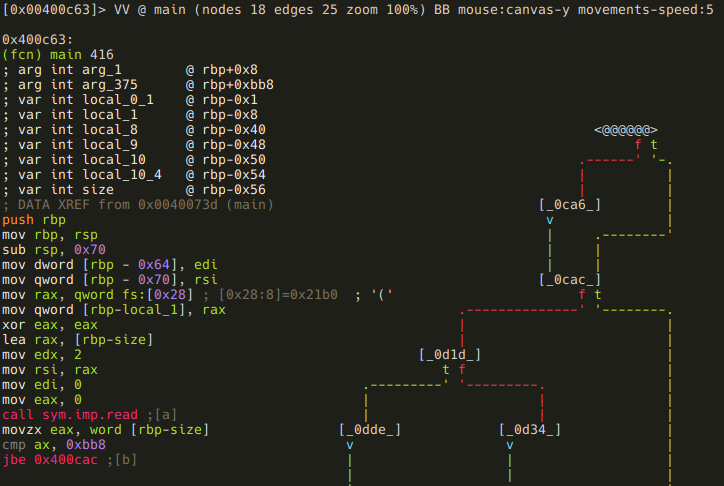

```
[0x00400c63]> VV @ main (nodes 18 edges 25 zoom 100%) BB mouse:canvas-y movements-speed:5

0x400c63:
(fcn) main 416
; arg int arg_1        @ rbp+0x8
; arg int arg_375      @ rbp+0xbb8
; var int local_0_1    @ rbp-0x1
; var int local_1      @ rbp-0x8
; var int local_8      @ rbp-0x40                                         <@@@@@@>
; var int local_9      @ rbp-0x48                                              f t
; var int local_10     @ rbp-0x50                                       .------' '-.
; var int local_10_4   @ rbp-0x54                                       |          |
; var int size         @ rbp-0x56                                       |          |
; DATA XREF from 0x0040073d (main)                                 [_0ca6_]        |
push rbp                                                            v              |
mov rbp, rsp                                                        |     .--------'
sub rsp, 0x70                                                       |     |
mov dword [rbp - 0x64], edi                                         |     |
mov qword [rbp - 0x70], rsi                                        [_0cac_]
mov rax, qword fs:[0x28] ; [0x28:8]=0x21b0  ; '('                       f t
mov qword [rbp-local_1], rax                             .--------------' '--------.
xor eax, eax                                             |                         |
lea rax, [rbp-size]                                      |                         |
mov edx, 2                                          [_0d1d_]                       |
mov rsi, rax                                           t f                         |
mov edi, 0                                   .---------' '---------.               |
mov eax, 0                                   |                     |               |
call sym.imp.read ;[a]                       |                     |               |
movzx eax, word [rbp-size]                [_0dde_]            [_0d34_]             |
cmp ax, 0xbb8                              v                   v                   |
jbe 0x400cac ;[b]                          |                   |                   |
                                           |                   |                   |

```

We can see that the program reads a word (2 bytes) into the local variable named
*local_10_6*, and than compares it to 0xbb8. Thats 3000 in decimal, btw:

```
[0x00400c63]> ? 0xbb8
3000 0xbb8 05670 2.9K 0000:0bb8 3000 10111000 3000.0 0.000000f 0.000000
```

> ***r2 tip***: yep, *?* will evaluate expressions, and print the result in
> various formats.

If the value is greater than 3000, then it will be forced to be 3000:

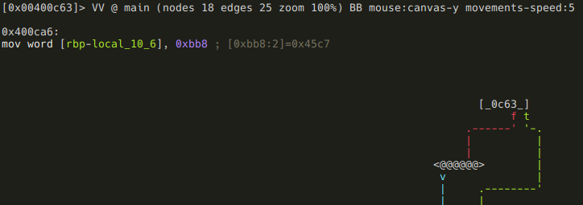

There are a few things happening in the next block:


First, the "Size of data: " message we saw when we run the program is printed.
So now we know, that the local variable *local_10_6* is the size of the input
data - so lets name it accordingly (remember, you can open the r2 shell from
visual mode using the *:* key!):

`:> afvn local_10_6 input_size`

> ***r2 tip***: The *af* command family is used to analyze functions. This
> includes manipulating arguments and local variables too, which is accessible
> via the *afv* commands. You can list function arguments (*afa*),  local
> variables (*afv*), or you can even rename them (*afan*, *afvn*). Of course
> there are lots of other features too - as usual: use the "?", Luke!

After this an *input_size* bytes long memory chunk is allocated, and filled with
data from the standard input. The address of this memory chunk is stored in
*local_10* - time to use *afvn* again:

`:> afvn local_10 input_data`

We've almost finished with this block, there are only two things remained.
First, an 512 (0x200) bytes memory chunk is zeroed out at offset 0x00602120.
A quick glance at XREFS to this address reveals that this memory is indeed used
somewhere in the application:

```
:> axt 0x00602120
d 0x400cfe mov edi, 0x602120
d 0x400d22 mov edi, 0x602120
d 0x400dde mov edi, 0x602120
d 0x400a51 mov qword [rbp - 8], 0x602120
```

Since it probably will be important later on, we should label it:

`:> f sym.memory 0x200 0x602120`

> ***r2 tip***: Flags can be managed using the *f* command family. We've just
> added the flag sym.memory to a 0x200 bytes long memory area at 0x602120. It is
> also possible to remove (*f-name*), rename (*fr [old] [new]*), add comment
> (*fC [name] [cmt]*) or even color (*fc [name] [color]*) flags.

While we are here, we should also declare that memory chunk as data, so it will
show up as a hexdump in disassembly view:

`:> Cd 0x200 @ sym.memory`

> ***r2 tip***: The command family *C* is used to manage metadata. You can set
> (*CC*) or edit (*CC*) comments, declare memory areas as data (*Cd*), strings
> (*Cs*), etc. These commands can also be issued via a menu in visual mode
> invoked by pressing *d*.

The only remaining thing in this block is a function call to 0x400a45 with the
input data as an argument. The function's return value is compared to "*", and
a conditional jump is executed depending on the result.

Earlier I told you that this crackme is probably based on a virtual machine.
Well, with that information in mind, one can guess, that this function will be
the VM's main loop, and the input data is the instructions the VM will execute.
Based on this hunch, I've named this function *vmloop*, and renamed
*input_data* to *bytecode* and *input_size* to *bytecode_length*. This is not
really necessery in a small project like this, but it's a good practice to name
stuff according to their purpose (just like when you are writing programs).

```
:> af vmloop 0x400a45
:> afvn input_size bytecode_length
:> afvn input_data bytecode
```

> ***r2 tip***: The *af* command is used to analyze function with a given named
> at the given address. The other two commands should be familiar from earlier.

After renaming local variables, flagging that memory area, and renaming the VM
loop function the disassembly looks like this:

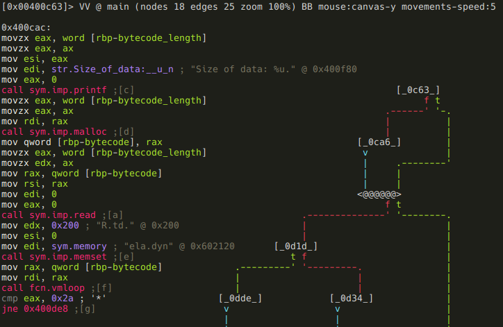

So, back to that conditional jump. If *vmloop* returns anything else than "*",
the program just exits without giving us our flag. Obviously we don't want that,
so we follow the false branch.


Now we see that a string in that 512 bytes memory area (*sym.memory*) gets
compared to "Such VM! MuCH reV3rse!". If they are not equal, the program prints
the bytecode, and exits:


OK, so now we know that we have to supply a bytecode that will generate that
string when executed. As we can see on the minimap, there are still a few more
branches ahead, which probably means more conditions to meet. Lets investigate
them before we delve into *vmloop*!

If you take a look at the minimap, you can probably recognize that there is some
kind of loop starting at block *[_0d34_]*, and it involves the following nodes:

- [_0d34_]
- [_0d65_]
- [_0d3d_]
- [_0d61_]

Here are the assembly listings for those blocks:


Putting 0 into local variable *local_10_4*.

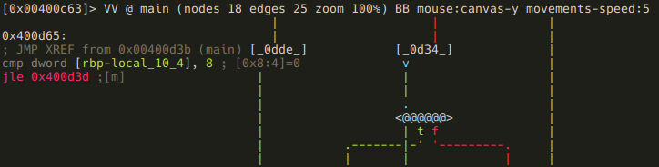

Comparing *local_10_4* to 8, and executing a conditional jump based on the
result. It's pretty obvious that *local_10_4* is the loop counter, so lets name
it accordingly:

`:> afvn local_10_4 i`

Next block is the actual loop body:

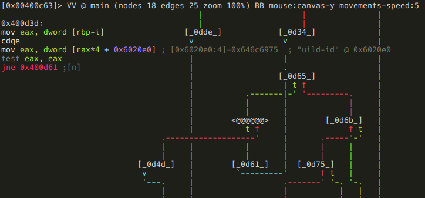

The memory area at 0x6020e0 is treated as an array of dwords (4 byte values),
and checked if the ith value of it is zero. If it is not, the loop simply
continues:

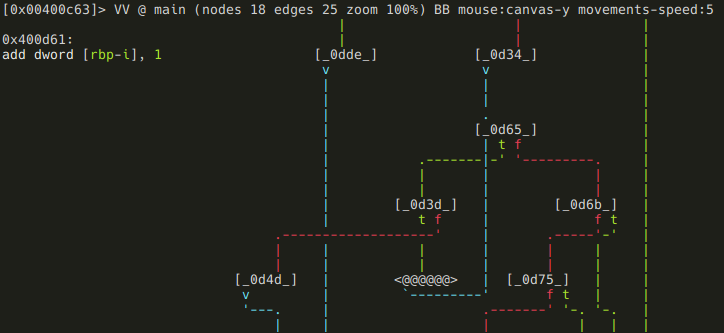

If the value is zero, the loop breaks and this block is executed before exiting:

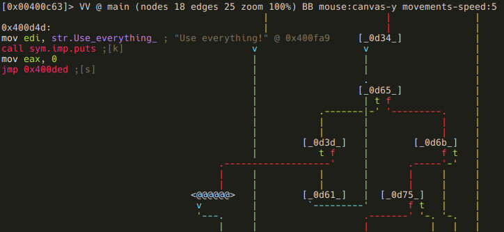

It prints the followin message: Use everything!" As we've established earlier,
we are dealing with a virtual machine. In that context, this message probably
means that we have to use every available instructions. Whether we executed an
instruction or not is stored at 0x6020e0 - so lets flag that memory area:

`:> f sym.instr_dirty 4*9 0x6020e0`

Assuming we don't break out and the loop completes, we are moving on to some
more checks:

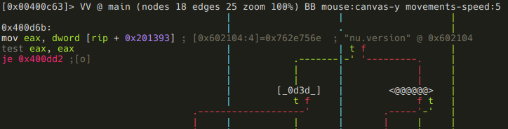

This piece of code may look a bit strange if you are not familiar with x86_64
specific stuff. In particular, we are talking about RIP-relative addressing,
where offsets are described as displacements from the current instruction
pointer, which makes implementing PIE easier. Anyways, r2 is nice enough to
display the actual address (0x602104). Got the address, flag it!

`:> f sym.good_if_ne_zero 4 0x602104`

Keep in mind though, that if RIP-relative addressing is used, flags won't appear
directly in the disassembly, but r2 displayes them as comments:

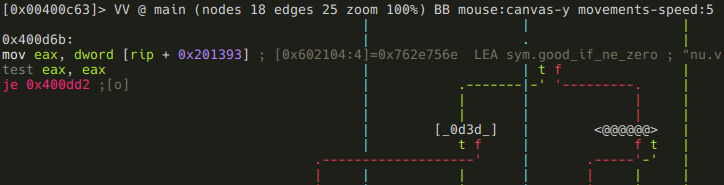

If *sym.good_if_ne_zero* is zero, we get a message ("Your getting closer!"), and
then the program exits. If it is non-zero, we move to the last check:


Here the program compares a dword at 0x6020f0 (again, RIP-relative addressing)
to 9. If its greater than 9, we get the same "Your getting closer!" message, but
if it's lesser, or equal to 9, we finally reach our destination, and get the flag:


As usual, we should flag 0x6020f0:

`:> f sym.good_if_le_9 4 0x6020f0`

Well, it seems that we have fully reversed the main function. To summarize it:
the program reads a bytecode from the standard input, and feeds it to a virtual
machine. After VM execution, the program's state have to satisfy these
conditions in order to reach the goodboy code:

- *vmloop*'s return value has to be "*"
- *sym.memory* has to contain the string "Such VM! MuCH reV3rse!"
- all 9 elements of *sym.instr_dirty* array should not be zero (probably means
  that all instructions had to be used at least once)
- *sym.good_if_ne_zero* should not be zero
- *sym.good_if_le_9* has to be lesser or equal to 9

This concludes our analysis of the main function, we can now move on to the VM
itself.

.vmloop
-------

`[offset]> fcn.vmloop`


Well, that seems disappointingly short, but no worries, we have plenty to
reverse yet. The thing is that this function uses a jump table at 0x00400a74,

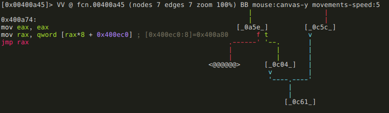

and r2 can't yet recognize jump tables (
[Issue 3201](https://github.com/radare/radare2/issues/3201)), so the analysis of
this function is a bit incomplete. This means that we can't really use the graph
view now, so either we just use visual mode, or fix those basic blocks. The
entire function is just 542 bytes long, so we certainly could reverse it without
the aid of the graph mode, but since this writeup aims to include as much r2
wisdom as possible, I'm going to show you how to define basic blocks.

But first, lets analyze what we already have! First, *rdi* is put into local_3.
Since the application is a 64bit Linux executable, we know that *rdi* is the
first function argument (as you may have recognized, the automatoc analysis of
arguments and local variables was not entirely correct), and we also know that
*vmloop*'s first argument is the bytecode. So lets rename local_3:

`:> afvn local_3 bytecode`

Next, *sym.memory* is put into another local variable at *rbp-8* that r2 did not
recognize. So let's define it!

`:> afv 8 memory qword`

> ***r2 tip***: The *afv [idx] [name] [type]* command is used to define local
> variable at [frame pointer - idx] with the name [name] and type [type]. You
> can also remove local variables using the *afv- [idx]* command.

In the next block, the program checks one byte of bytecode, and if it is 0, the
function returns with 1.

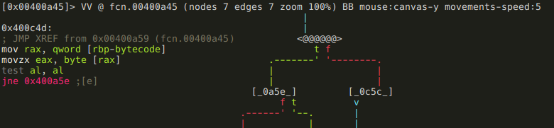

If that byte is not zero, the program subtracts 0x41 from it, and compares the
result to 0x17. If it is above 0x17, we get the dreaded "Wrong!" message, and
the function returns with 0. This basically means that valid bytecodes are ASCII
characters in the range of "A" (0x41) through "X" (0x41 + 0x17). If the bytecode
is valid, we arrive at the code piece that uses the jump table:


The jump table's base is at 0x400ec0, so lets define that memory area as a
series of qwords:

```
[0x00400a74]> s 0x00400ec0
[0x00400ec0]> Cd 8 @@=`?s $$ $$+8*0x17 8`
```

> ***r2 tip***: Except for the *?s*, all parts of this command should be
> familiar now, but lets recap it! *Cd* defines a memory area as data, and 8 is
> the size of that memory area. *@@* is an iterator that make the preceeding
> command run for every element that *@@* holds. In this example it holds a
> series generated using the *?s* command. *?s* simply generates a series from
> the current seek (*$$*) to current seek + 8*0x17 (*$$+8*0x17*) with a step
> of 8.

This is how the disassembly looks like after we add this metadata:

```
[0x00400ec0]> pd 0x18
            ; DATA XREF from 0x00400a76 (unk)
            0x00400ec0 .qword 0x0000000000400a80
            0x00400ec8 .qword 0x0000000000400c04
            0x00400ed0 .qword 0x0000000000400b6d
            0x00400ed8 .qword 0x0000000000400b17
            0x00400ee0 .qword 0x0000000000400c04
            0x00400ee8 .qword 0x0000000000400c04
            0x00400ef0 .qword 0x0000000000400c04
            0x00400ef8 .qword 0x0000000000400c04
            0x00400f00 .qword 0x0000000000400aec
            0x00400f08 .qword 0x0000000000400bc1
            0x00400f10 .qword 0x0000000000400c04
            0x00400f18 .qword 0x0000000000400c04
            0x00400f20 .qword 0x0000000000400c04
            0x00400f28 .qword 0x0000000000400c04
            0x00400f30 .qword 0x0000000000400c04
            0x00400f38 .qword 0x0000000000400b42
            0x00400f40 .qword 0x0000000000400c04
            0x00400f48 .qword 0x0000000000400be5
            0x00400f50 .qword 0x0000000000400ab6
            0x00400f58 .qword 0x0000000000400c04
            0x00400f60 .qword 0x0000000000400c04
            0x00400f68 .qword 0x0000000000400c04
            0x00400f70 .qword 0x0000000000400c04
            0x00400f78 .qword 0x0000000000400b99
```

As we can see, the address 0x400c04 is used a lot, and besides that there are 9
different addresses. Lets see that 0x400c04 first!

```
[0x00400ec0]> pd 4 @ 0x400c04
|           0x00400c04    bf980e4000     mov edi, str.Wrong_ ; "Wrong!" @ 0x400e98
|           0x00400c09    e862faffff     call sym.imp.puts
|           0x00400c0e    b800000000     mov eax, 0
|           0x00400c13    eb4c           jmp 0x400c61
```

We get the message "Wrong!", and the function just returns 0. This means that
those are not valid instructions (they are valid bytecode though, they can be
e.g. parameters!) We should flag 0x400c04 accordingly:

`[0x00400ec0]> f not_instr @ 0x0000000000400c04`

As for the other offsets, they all seem to be doing something meaningful, so we
can assume they belong to valid instructions. I'm goind to flag them using the
instructions' ASCII values:

```
[0x00400ec0]> f instr_A @ 0x0000000000400a80
[0x00400ec0]> f instr_C @ 0x0000000000400b6d
[0x00400ec0]> f instr_D @ 0x0000000000400b17
[0x00400ec0]> f instr_I @ 0x0000000000400aec
[0x00400ec0]> f instr_J @ 0x0000000000400bc1
[0x00400ec0]> f instr_P @ 0x0000000000400b42
[0x00400ec0]> f instr_R @ 0x0000000000400be5
[0x00400ec0]> f instr_S @ 0x0000000000400ab6
[0x00400ec0]> f instr_X @ 0x0000000000400b99
```

Ok, so these offsets were not on the graph, so it is time to define basic blocks
for them!

> ***r2 tip***: You can define basic blocks using the *afb+* command. You have
> to supply what function the block belongs to, where does it start, and what is
> its size. If the block ends in a jump, you have to specify where does it jump
> too. If the jump is a conditional jump, the false branch's destination address
> should be specified too.

We can get the start and end addresses of these basic blocks from the full disasm
of *vmloop*.

```
[0x00400ec0]>pdf @ fcn.vmloop
/ (fcn) fcn.00400a45 542
|           ; arg int arg_787492   @ rbp+0x602120
|           ; var int local_0_1    @ rbp-0x1
|           ; var qword memory       @ rbp-0x8
|           ; var int bytecode     @ rbp-0x18
|           ;-- fcn.vmloop:
|           0x00400a45    55             push rbp
|           0x00400a46    4889e5         mov rbp, rsp
|           0x00400a49    4883ec20       sub rsp, 0x20
|           0x00400a4d    48897de8       mov qword [rbp-bytecode], rdi
|           0x00400a51    48c745f82021.  mov qword [rbp-memory], sym.memory
|       ,=< 0x00400a59    e9ef010000     jmp 0x400c4d
|       |   0x00400a5e    488b45e8       mov rax, qword [rbp-bytecode]
|       |   0x00400a62    0fb600         movzx eax, byte [rax]
|       |   0x00400a65    0fbec0         movsx eax, al
|       |   0x00400a68    83e841         sub eax, 0x41
|       |   0x00400a6b    83f817         cmp eax, 0x17
|      ,==< 0x00400a6e    0f8790010000   ja 0x400c04
|      ||   0x00400a74    89c0           mov eax, eax
|      ||   0x00400a76    488b04c5c00e.  mov rax, qword [raxi*8 + 0x400ec0]
|      ||   0x00400a7e    ffe0           jmp rax
|      ||   ;-- instr_A:
|      ||   0x00400a80    8b055a162000   mov eax, dword [rip + 0x20165a]
|      ||   0x00400a86    83c001         add eax, 1
|      ||   0x00400a89    890551162000   mov dword [rip + 0x201651], eax
|      ||   0x00400a8f    488b45e8       mov rax, qword [rbp-bytecode]
|      ||   0x00400a93    488d5002       lea rdx, [rax + 2]
|      ||   0x00400a97    488b45e8       mov rax, qword [rbp-bytecode]
|      ||   0x00400a9b    4883c001       add rax, 1
|      ||   0x00400a9f    4889d6         mov rsi, rdx
|      ||   0x00400aa2    4889c7         mov rdi, rax
|      ||   0x00400aa5    e863fdffff     call 0x40080d
|      ||   0x00400aaa    c745f4030000.  mov dword [rbp - 0xc], 3
|     ,===< 0x00400ab1    e95f010000     jmp 0x400c15
|     |||   ;-- instr_S:
|     |||   0x00400ab6    8b0528162000   mov eax, dword [rip + 0x201628]
|     |||   0x00400abc    83c001         add eax, 1
|     |||   0x00400abf    89051f162000   mov dword [rip + 0x20161f], eax
|     |||   0x00400ac5    488b45e8       mov rax, qword [rbp-bytecode]
|     |||   0x00400ac9    488d5002       lea rdx, [rax + 2]
|     |||   0x00400acd    488b45e8       mov rax, qword [rbp-bytecode]
|     |||   0x00400ad1    4883c001       add rax, 1
|     |||   0x00400ad5    4889d6         mov rsi, rdx
|     |||   0x00400ad8    4889c7         mov rdi, rax
|     |||   0x00400adb    e8bffdffff     call 0x40089f
|     |||   0x00400ae0    c745f4030000.  mov dword [rbp - 0xc], 3
|    ,====< 0x00400ae7    e929010000     jmp 0x400c15
|    ||||   ;-- instr_I:
|    ||||   0x00400aec    8b05f6152000   mov eax, dword [rip + 0x2015f6]
|    ||||   0x00400af2    83c001         add eax, 1
|    ||||   0x00400af5    8905ed152000   mov dword [rip + 0x2015ed], eax
|    ||||   0x00400afb    488b45e8       mov rax, qword [rbp-bytecode]
|    ||||   0x00400aff    4883c001       add rax, 1
|    ||||   0x00400b03    4889c7         mov rdi, rax
|    ||||   0x00400b06    e856feffff     call 0x400961
|    ||||   0x00400b0b    c745f4020000.  mov dword [rbp - 0xc], 2
|   ,=====< 0x00400b12    e9fe000000     jmp 0x400c15
|   |||||   ;-- instr_D:
|   |||||   0x00400b17    8b05cf152000   mov eax, dword [rip + 0x2015cf]
|   |||||   0x00400b1d    83c001         add eax, 1
|   |||||   0x00400b20    8905c6152000   mov dword [rip + 0x2015c6], eax
|   |||||   0x00400b26    488b45e8       mov rax, qword [rbp-bytecode]
|   |||||   0x00400b2a    4883c001       add rax, 1
|   |||||   0x00400b2e    4889c7         mov rdi, rax
|   |||||   0x00400b31    e806feffff     call 0x40093c
|   |||||   0x00400b36    c745f4020000.  mov dword [rbp - 0xc], 2
|  ,======< 0x00400b3d    e9d3000000     jmp 0x400c15
|  ||||||   ;-- instr_P:
|  ||||||   0x00400b42    8b05a8152000   mov eax, dword [rip + 0x2015a8]
|  ||||||   0x00400b48    83c001         add eax, 1
|  ||||||   0x00400b4b    89059f152000   mov dword [rip + 0x20159f], eax
|  ||||||   0x00400b51    488b45e8       mov rax, qword [rbp-bytecode]
|  ||||||   0x00400b55    4883c001       add rax, 1
|  ||||||   0x00400b59    4889c7         mov rdi, rax
|  ||||||   0x00400b5c    e825feffff     call 0x400986
|  ||||||   0x00400b61    c745f4020000.  mov dword [rbp - 0xc], 2
| ,=======< 0x00400b68    e9a8000000     jmp 0x400c15
| |||||||   ;-- instr_C:
| |||||||   0x00400b6d    8b0581152000   mov eax, dword [rip + 0x201581]
| |||||||   0x00400b73    83c001         add eax, 1
| |||||||   0x00400b76    890578152000   mov dword [rip + 0x201578], eax
| |||||||   0x00400b7c    488b45e8       mov rax, qword [rbp-bytecode]
| |||||||   0x00400b80    4883c001       add rax, 1
| |||||||   0x00400b84    0fb600         movzx eax, byte [rax]
| |||||||   0x00400b87    0fbec0         movsx eax, al
| |||||||   0x00400b8a    890530152000   mov dword [rip + 0x201530], eax
| |||||||   0x00400b90    c745f4020000.  mov dword [rbp - 0xc], 2
| ========< 0x00400b97    eb7c           jmp 0x400c15
| |||||||   ;-- instr_X:
| |||||||   0x00400b99    8b0559152000   mov eax, dword [rip + 0x201559]
| |||||||   0x00400b9f    83c001         add eax, 1
| |||||||   0x00400ba2    890550152000   mov dword [rip + 0x201550], eax
| |||||||   0x00400ba8    488b45e8       mov rax, qword [rbp-bytecode]
| |||||||   0x00400bac    4883c001       add rax, 1
| |||||||   0x00400bb0    4889c7         mov rdi, rax
| |||||||   0x00400bb3    e867feffff     call 0x400a1f
| |||||||   0x00400bb8    c745f4020000.  mov dword [rbp - 0xc], 2
| ========< 0x00400bbf    eb54           jmp 0x400c15
| |||||||   ;-- instr_J:
| |||||||   0x00400bc1    8b0535152000   mov eax, dword [rip + 0x201535]
| |||||||   0x00400bc7    83c001         add eax, 1
| |||||||   0x00400bca    89052c152000   mov dword [rip + 0x20152c], eax
| |||||||   0x00400bd0    488b45e8       mov rax, qword [rbp-bytecode]
| |||||||   0x00400bd4    4883c001       add rax, 1
| |||||||   0x00400bd8    4889c7         mov rdi, rax
| |||||||   0x00400bdb    e8d8fdffff     call 0x4009b8
| |||||||   0x00400be0    8945f4         mov dword [rbp - 0xc], eax
| ========< 0x00400be3    eb30           jmp 0x400c15
| |||||||   ;-- instr_R:
| |||||||   0x00400be5    8b0515152000   mov eax, dword [rip + 0x201515]
| |||||||   0x00400beb    83c001         add eax, 1
| |||||||   0x00400bee    89050c152000   mov dword [rip + 0x20150c], eax
| |||||||   0x00400bf4    488b45e8       mov rax, qword [rbp-bytecode]
| |||||||   0x00400bf8    4883c001       add rax, 1
| |||||||   0x00400bfc    0fb600         movzx eax, byte [rax]
| |||||||   0x00400bff    0fbec0         movsx eax, al
| ========< 0x00400c02    eb5d           jmp 0x400c61
| ||||||    ;-- not_instr:
| |||||`--> 0x00400c04    bf980e4000     mov edi, str.Wrong_
| ||||| |   0x00400c09    e862faffff     call sym.imp.puts
| ||||| |   0x00400c0e    b800000000     mov eax, 0
| ========< 0x00400c13    eb4c           jmp 0x400c61
| `````---> 0x00400c15    8b45f4         mov eax, dword [rbp - 0xc]
|       |   0x00400c18    4898           cdqe
|       |   0x00400c1a    480145e8       add qword [rbp-bytecode], rax
|       |   0x00400c1e    488b05631420.  mov rax, qword [rip + 0x201463]
|       |   0x00400c25    483d20216000   cmp rax, sym.memory
| ========< 0x00400c2b    720f           jb 0x400c3c
|       |   0x00400c2d    488b05541420.  mov rax, qword [rip + 0x201454]
|       |   0x00400c34    483d20236000   cmp rax, section_end..bss
| ========< 0x00400c3a    7211           jb 0x400c4d
| --------> 0x00400c3c    bf9f0e4000     mov edi, str.We_are_in_the_outer_space\_
|       |   0x00400c41    e82afaffff     call sym.imp.puts
|       |   0x00400c46    b800000000     mov eax, 0
| ========< 0x00400c4b    eb14           jmp 0x400c61
| ------`-> 0x00400c4d    488b45e8       mov rax, qword [rbp-bytecode]
|           0x00400c51    0fb600         movzx eax, byte [rax]
|           0x00400c54    84c0           test al, al
|           0x00400c56    0f8502feffff   jne 0x400a5e
|           0x00400c5c    b801000000     mov eax, 1
| --------> 0x00400c61    c9             leave
\           0x00400c62    c3             ret

```

As I've mentioned previously, the function itself is pretty short, and easy to
read, especially with out annotations. But a promise is a promise, so here is
how we can create the missing bacic blocks for the instructions:


```
[0x00400ec0]> afb+ 0x00400a45 0x00400a80 0x00400ab6-0x00400a80 0x400c15
[0x00400ec0]> afb+ 0x00400a45 0x00400ab6 0x00400aec-0x00400ab6 0x400c15
[0x00400ec0]> afb+ 0x00400a45 0x00400aec 0x00400b17-0x00400aec 0x400c15
[0x00400ec0]> afb+ 0x00400a45 0x00400b17 0x00400b42-0x00400b17 0x400c15
[0x00400ec0]> afb+ 0x00400a45 0x00400b42 0x00400b6d-0x00400b42 0x400c15
[0x00400ec0]> afb+ 0x00400a45 0x00400b6d 0x00400b99-0x00400b6d 0x400c15
[0x00400ec0]> afb+ 0x00400a45 0x00400b99 0x00400bc1-0x00400b99 0x400c15
[0x00400ec0]> afb+ 0x00400a45 0x00400bc1 0x00400be5-0x00400bc1 0x400c15
[0x00400ec0]> afb+ 0x00400a45 0x00400be5 0x00400c04-0x00400be5 0x400c15
```

It is also appearent from the disassembly that besides the instructions there
are three more basic blocks. Lets create them too!

```
[0x00400ec0]> afb+ 0x00400a45 0x00400c15 0x00400c2d-0x00400c15 0x400c3c 0x00400c2d
[0x00400ec0]> afb+ 0x00400a45 0x00400c2d 0x00400c3c-0x00400c2d 0x400c4d 0x00400c3c
[0x00400ec0]> afb+ 0x00400a45 0x00400c3c 0x00400c4d-0x00400c3c 0x400c61
```

Note that the basic blocks starting at 0x00400c15 and 0x00400c2d ending in a
conditional jump, so we had to set the false branch's destination too!

And here is the graph in its full glory after a bit of manual restructuring:


I think it worth it, don't you? :) (Well, the reorganizing did really not worth
it, because it is apparently not stored when you save the project.)

> ***r2 tip***: You can move the selected node around in graph view using the
> HJKL keys. The *?* documentation needs to be fixed on this part though: the
> move node (HJKL) and the move canvas (hjkl) keys are swapped there.

As we browse through the disassembly of the *instr_LETTER* basic blocks, we
should realize a few things. The first: ll of the instructions starts with a
sequence like these:

```
0x400a80:
instr_A:
mov eax, dword [rip + 0x20165a] ; [0x6020e0:4]=0x646c6975  LEA sym.instr_dirty
add eax, 1
mov dword [rip + 0x201651], eax ; [0x6020e0:4]=0x646c6975  LEA sym.instr_dirty
```

```
0x400ab6:
instr_S:
mov eax, dword [rip + 0x201628] ; [0x6020e4:4]=0x64692d  ; "-id" @ 0x6020e4
add eax, 1
mov dword [rip + 0x20161f], eax ; [0x6020e4:4]=0x64692d  ; "-id" @ 0x6020e4
```

It became clear now that the 9 dwords at *sym.instr_dirty* are not simply
indicators that an instruction got executed, but they are used to count how many
times an instruction got called. Also I should have realized earlier that
*sym.good_if_le_9* (0x6020f0) is part of this 9 dword array, but yeah, well, I
didn't. Anyways, what the condition *sym.good_if_le_9* have to be lesser or
equal 9 really means is that *instr_P* can not be executed more than 9 times.

```
0x400b42:
instr_P:
mov eax, dword [rip + 0x2015a8] ; [0x6020f0:4]=0x642e0068  LEA sym.good_if_le_9
add eax, 1
mov dword [rip + 0x20159f], eax ; [0x6020f0:4]=0x642e0068  LEA sym.good_if_le_9
```

Another similarity of the instructions is that 7 of them calls a function with
either one or two parameters, where the parameters are the next, or the next two
bytecodes. One parameter example:

```
0x400aec:
instr_I:
mov eax, dword [rip + 0x2015f6] ; [0x6020e8:4]=0x756e672e
add eax, 1
mov dword [rip + 0x2015ed], eax ; [0x6020e8:4]=0x756e672e
mov rax, qword [rbp-bytecode]
add rax, 1
mov rdi, rax
call 0x400961 ;[i]
mov dword [rbp - 0xc], 2
jmp 0x400c15 ;[d]

```

And a two parameters example:

```
0x400a80:
instr_A:
mov eax, dword [rip + 0x20165a] ; [0x6020e0:4]=0x646c6975  LEA sym.instr_dirty
add eax, 1
mov dword [rip + 0x201651], eax ; [0x6020e0:4]=0x646c6975  LEA sym.instr_dirty
mov rax, qword [rbp-bytecode]
lea rdx, [rax + 2] ; 0x2
mov rax, qword [rbp-bytecode]
add rax, 1
mov rsi, rdx
mov rdi, rax
call 0x40080d ;[c]
mov dword [rbp - 0xc], 3
jmp 0x400c15 ;[d]
```

We should also realize that these blocks put the number of bytes they eat up of
the bytecode (1 byte instruction + 1 or 2 bytes arguments) into a local variable
at 0xc. r2 did not recognize this local var, so lets do it manually!

```
:> afv 0xc instr_ptr_step dword
```

If we look at *instr_J* we can see that this is an exception to the above rule,
since it puts the return value of the called function into *instr_ptr_step*
instead of a constant 2 or 3:

```
0x400bc1:
instr_J:
mov eax, dword [rip + 0x201535] ; [0x6020fc:4]=0x74736e79  ; "ynstr" @ 0x6020fc
add eax, 1
mov dword [rip + 0x20152c], eax ; [0x6020fc:4]=0x74736e79  ; "ynstr" @ 0x6020fc
mov rax, qword [rbp-bytecode]
add rax, 1
mov rdi, rax
call 0x4009b8 ;[m]
mov dword [rbp-instr_ptr_step], eax
jmp 0x400c15 ;[d]
```

And speaking of exceptions, here are the two instructions that do not call functions:

```
0x400be5:
instr_R:
mov eax, dword [rip + 0x201515] ; [0x602100:4]=0x672e0072  ; "r" 0x00602100  ; "r" @ 0x602100
add eax, 1
mov dword [rip + 0x20150c], eax ; [0x602100:4]=0x672e0072  ; "r" 0x00602100  ; "r" @ 0x602100
mov rax, qword [rbp-bytecode]
add rax, 1
movzx eax, byte [rax]
movsx eax, al
jmp 0x400c61 ;[f]
```

This one simply puts the next bytecode (the first the argument) into *eax*, and
jumps to the end of *vmloop*. So this is the VM's *ret* instruction, and we know
that *vmloop* has to return "*", so "R*" should be the last two bytes of our
bytecode.

The next one that does not call a function:

```
0x400b6d:
instr_C:
mov eax, dword [rip + 0x201581] ; [0x6020f4:4]=0x79736e79  ; "ynsym" @ 0x6020f4
add eax, 1
mov dword [rip + 0x201578], eax ; [0x6020f4:4]=0x79736e79  ; "ynsym" @ 0x6020f4
mov rax, qword [rbp-bytecode]
add rax, 1
movzx eax, byte [rax]
movsx eax, al
mov dword [rip + 0x201530], eax ; [0x6020c0:4]=0x65746e69  ; "interp" @ 0x6020c0
mov dword [rbp-instr_ptr_step], 2
jmp 0x400c15 ;[d]
```

This is a one argument instruction, and it puts its argument to 0x6020c0. Flag
that address!

```
:> f sym.written_by_instr_C 4 @ 0x6020c0
```

Oh, and by the way, I do have a hunch that *instr_C* also had a function call in
the original code, but it got inlined by the compiler. Anyways, so far we have
these two instructions:

- *instr_R(a1):* returns with *a1*
- *instr_C(a1):* writes *a1* to sym.written_by_instr_C

And we also know that these accept one argument,

- instr_I
- instr_D
- instr_P
- instr_X
- instr_J

and these accept two:

- instr_A
- instr_S

What remains is the reversing of the seven functions that are called by the
instructions, and finally the construction of a valid bytecode that gives us the
flag.

**instr_A**

The function this instruction calls is at offset 0x40080d, so lets seek there!

```
[offset]> 0x40080d
```

> ***r2 tip:*** In visual mode you can just hit \<Enter\> when the current line is
> a jump or a call, and r2 will seek to the destination address.

If we seek to that address from the graph mode, we are presented with a message
that says "Not in a function. Type 'df' to define it here. This is because the
function is called from a basic block r2 did not recognize, so r2 could not
find the function either. Lets obey, and type *df*! A function is indeed created,
but want some meaningful name for it. So press *dr* while still in visual mode, and
name this function *instr_A*!


> ***r2 tip:*** You should realize that these commands are all part of the same
> menu system in visual mode I was talking about when we first used *Cd* to
> declare *sym.memory* as data.

Ok, now we have our shiny new *fcn.instr_A*, lets reverse it! We can see from
the shape of the minimap that probably there is some kind cascading
if-then-elif, or a switch-case statement involved in this function. This is one
of the reasons the minimap is so useful: you can recognize some patterns at a
glance, which can help you in your analysis (remember the easily recognizable
for loop from a few paragraphs before?) So, the minimap is cool and useful, but
I've just realized that I did not yet show you the full graph mode, so I'm
going to do this using full graph. The first basic blocks:


The two function arguments (*rdi* and *rsi*) are stored in local variables, and
the first is compared to 0. If it is, the function returns (you can see it on
the minimap), otherwise the same check is executed on the second argument. The
function returns from here too, if the argument is zero. Although this function
is really tiny, I am going to stick with my methodology, and rename the local
vars:

```
:> afvn local_1 arg1
:> afvn local_2 arg2
```

And we have arrived to the predicted switch-case statement, and we can see that
*arg1*'s value is checked agains "M", "P", and "C".


This is the "M" branch:

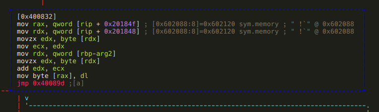

It basically loads an address from offset 0x602088 and adds *arg2* to the byte
at that address. As r2 kindly shows us in a comment, 0x602088 initially holds
the address of *sym.memory*, the area where we have to construct the "Such VM!
MuCH reV3rse!" string. It is safe to assume that somehow we will be able to
modify the value stored at 0x602088, so this "M" branch will be able to modify
bytes other than the first. Based on this assumption, I'll flag 0x602088 as
*sym.current_memory_ptr*:

```
:> f sym.current_memory_ptr 8 @ 0x602088
```

Moving on to the "P" branch:

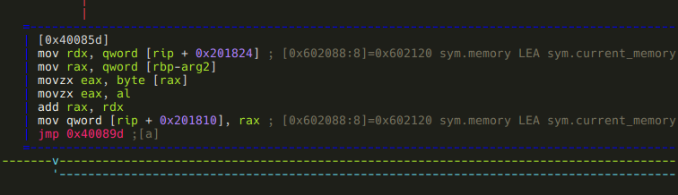

Yes, this is the piece of code that allows us to modify
*sym.current_memory_ptr*: it adds *arg2* to it.

Finally, the "C" branch:


Well, it turned out that *sym.written_by_instr_C* is not written only by
*instr_C*, but by *instr_A* too: this piece of code adds *arg2* to it.

And that was *instr_A*, lets summarize it! Depending on the first argument, this
instruction does the following:

- *arg1* == "M": adds *arg2* to the byte at *sym.current_memory_ptr*.
- *arg1* == "P": steps *sym.current_memory_ptr* by *arg2* bytes.
- *arg1* == "C": adds *arg2* to the value at *sym.written_by_instr_C*.

**instr_S**

This function is not recognized either, so we have to manually define it like we
did with *instr_A*. After we do, and take a look at the minimap, scroll through
the basic blocks, it is pretty obvious that these two functions are very-very
similar. We can use *radiff2* to see the difference.

> ***r2 tip:*** radiff2 is used to compare binary files. There's a few options
> we can control the type of binary diffing the tool does, and to what kind of
> output format we want. One of the cool features is that it can generate
> [DarumGrim](http://www.darungrim.org/)-style bindiff graphs using the *-g*
> option.

Since now we want to diff two functions from the same binary, we specify the
offsets with *-g*, and use reverse4 for both binaries. Also, we create the
graphs for comparing *instr_A* to *instr_S* and for comparing *instr_S* to
*instr_A*.

```
[0x00 ~]$ radiff2 -g 0x40080d,0x40089f  reverse4 reverse4 | xdot -
```

```
[0x00 ~]$ radiff2 -g 0x40089f,0x40080d  reverse4 reverse4 | xdot -
```


Two things should be obvious from these pictures: the first is that radiff2 is a
liar! In theory, grey boxes should be identical, yellow ones should differ only
at some offsets, and red ones should differ seriously. Well this is obviously
not the case here - e.g. the larger grey boxes at clearly not identical (this is
something I'm going to take a deeper look at after I've finished this writeup).
The second obvious thing is that *instr_S* is basically a reverse-*instr_A*:
where the latter does addition, the former does subtraction. To summarize this:

- *arg1* == "M": subtracts *arg2* from the byte at *sym.current_memory_ptr*.
- *arg1* == "P": steps *sym.current_memory_ptr* backwards by *arg2* bytes.
- *arg1* == "C": subtracts *arg2* from the value at *sym.written_by_instr_C*.

**instr_I**

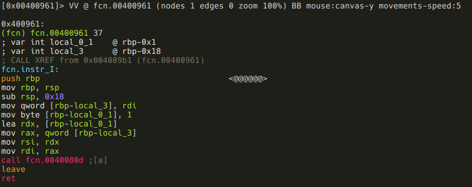

This one is simple, it just calls *instr_A(arg1, 1)*. As you may have noticed
the function call looks like `call fcn.0040080d` instead of `call fcn.instr_A`.
This is because when you save and open a project, function names get lost -
another thing to examine and patch in r2!

**instr_D**

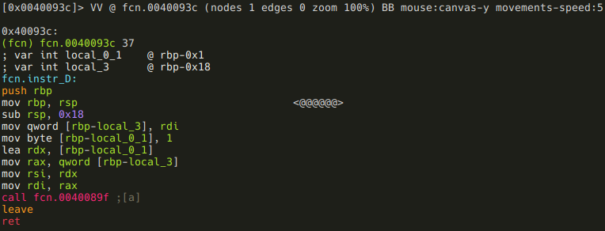

Again, simple: it calls *instr_S(arg1, 1)*.

**instr_P**

It's local var rename time again!

```
:> afvn local_0_1 const_M
:> afvn local_0_2 const_P
:> afvn local_3 arg1
```

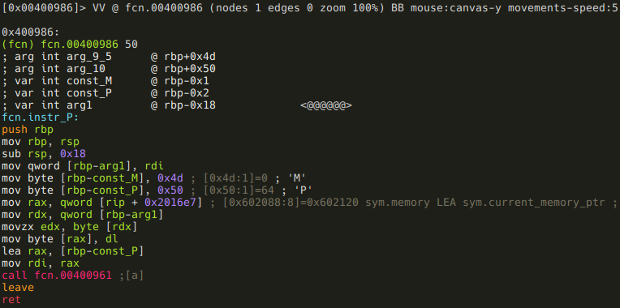

This function is pretty straightforward also, but there is one oddity: const_M
is never used. I don't know why it is there - maybe it is supposed to be some
kind of distraction? Anyways, this function simply writes *arg1* to
*sym.current_memory_ptr*, and than calls *instr_I("P")*. This basically means
that *instr_P* is used to write one byte, and put the pointer to the next byte.
So far this would seem the ideal instruction to construct most of the "Such VM!
MuCH reV3rse!" string, but remember, this is also the one that can be used only
9 times!

**instr_X**

Another simple one, rename local vars anyways!

```
:> afvn local_1 arg1
```

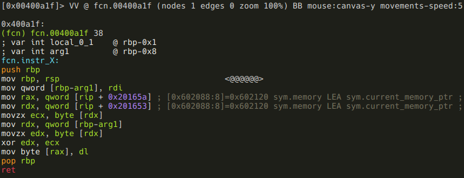

This function XORs the value at *sym.current_memory_ptr* with *arg1*.

**instr_J**

This one is not as simple as the previous ones, but it's not that complicated
either. Since I'm obviously obsessed by variable renaming:

```
:> afvn local_3 arg1
:> afvn local_0_4 arg1_and_0x3f
```


After the result of *arg1 & 0x3f* is put into a local variable, *arg1 & 0x40* is
checked against 0. If it isn't zero, *arg1_and_0x3f* is negated:

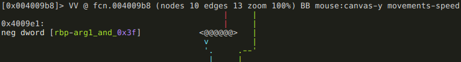

The next branching: if *arg1* >= 0, then the function returns *arg1_and_0x3f*,

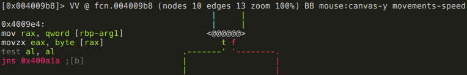

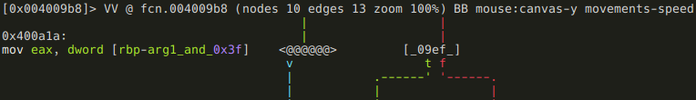

else the function branches again, based on the value of
*sym.written_by_instr_C*:

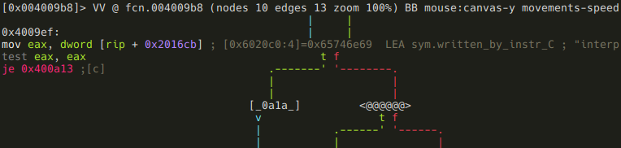

If it is zero, the function returns 2,

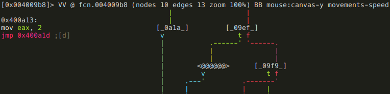

else it is checked if *arg1_and_0x3f* is a negative number,

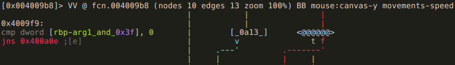

and if it is, *sym.good_if_ne_zero* is incremented by 1:

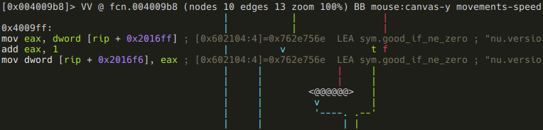

After all this, the function returns with *arg1_and_0x3f*:

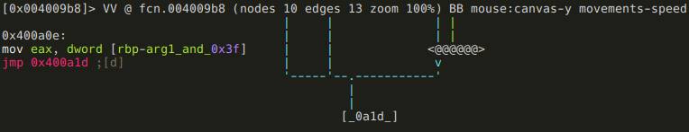

.instructionset
---------------

We've now reversed all the VM instructions, and have a full understanding about
how it works. Here is the VM's instruction set:

| Instruction | 1st arg | 2nd arg | What it does?
| ----------- | ------- | ------- | -------------
| "A"         | "M"     | arg2    | \*sym.current_memory_ptr += arg2
|             | "P"     | arg2    | sym.current_memory_}ptr += arg2
|             | "C"     | arg2    | sym.written_by_instr_C += arg2
| "S"         | "M"     | arg2    | \*sym.current_memory_ptr -= arg2
|             | "P"     | arg2    | sym.current_memory_ptr -= arg2
|             | "C"     | arg2    | sym.written_by_instr_C -= arg2
| "I"         | arg1    | n/a     | instr_A(arg1, 1)
| "D"         | arg1    | n/a     | instr_S(arg1, 1)
| "P"         | arg1    | n/a     | \*sym.current_memory_ptr = arg1; instr_I("P")
| "X"         | arg1    | n/a     | \*sym.current_memory_ptr ^= arg1
| "J"         | arg1    | n/a     | arg1_and_0x3f = arg1 & 0x3f;<br>if (arg1 & 0x40 != 0)<br>&nbsp;&nbsp;arg1_and_0x3f \*= -1<br>if (arg1 >= 0) return arg1 & 0x3f;<br>else if (\*sym.written_by_instr_C != 0) {<br>&nbsp;&nbsp;if (arg1 & 0x3f < 0)<br>&nbsp;&nbsp;&nbsp;&nbsp;++\*sym.good_if_ne_zero;<br>&nbsp;&nbsp;return arg1 & 0x3f;<br>} else return 2; |
| "C"         | arg1 | n/a        | \*sym.written_by_instr_C = arg1
| "R"         | arg1 | n/a        | return(arg1)


.bytecode
---------

Well, we did the reverse engineering part, now we have to write a program for
the VM with the instruction set described in the previous paragraph. Here is
the program's functional specification:

- the program must return "*"
- *sym.memory* has to contain the string "Such VM! MuCH reV3rse!"
- all 9 instructions have to be used at least once
- *sym.good_if_ne_zero* should not be zero
- instr_P is not allowed to be used more than 9 times

Since this document is about reversing and not about programming, I'll leave the
programming part to the fellow reader :) But I'm not going to leave you
empty-handed, here is the quick'n'dirty program I've used during the CTF:

```
\x90\x00PSAMuAP\x01AMcAP\x01AMhAP\x01AM AP\x01AMVAP\x01AMMAP\x01AM!AP\x01AM AP\x01AMMAP\x01AMuAP\x01AMCAP\x01AMHAP\x01AM AP\x01AMrAP\x01AMeAP\x01AMVAP\x01AM3AP\x01AMrAP\x01AMsAP\x01AMeIPAM!X\x00CAJ\xc1SC\x00DCR*
```

Maybe you should try to reverse it ;) Keep in mind please, that it was written
on-the-fly, parallel to the reversing phase - for example there are parts that
was written without the knowledge of all possible instructions. This means that
the code is ugly and unefficient.

.outro
------

Well, what can I say? Such VM, much reverse! :)

What started out as a simple writeup for a simple crackme, became a rather
lengthy writeup/r2 tutorial, so kudos if you've read through it. I hope you
enjoyed it (I know I did), and maybe even learnt something from it. I've surely
learnt a lot about r2 during the process, and I've even contributed some small
patches, and got a few ideas of more possible improvements.

