Cheating my way out of donfos's prison
======================================

.toc
----

* [.intro](#intro)
* [.first_steps](#first_steps)
* [.follow_the_money](#follow_the_money)
	* [.ugly_ass_xors](#ugly_ass_xors)
* [.solution](#solution)
	* [.theory](#theory)
	* [.practice](#practice)
* [.outro](#outro)

.intro
------

PrisonBreak was the 4th reverse engineering challenge at HackIM 2016 CTF. As
usual, I opened it in r2, and tried to switch to the graph view ("*VV*") - It
took quite a bit of time to draw the graph, let alone switch to the minimap
("*p*").

Two things became clear after this:

 - This is not just a prison, but a fracking maze.
 - I won't be using the graph view for this one.

.first_steps
------------

Ok, here is the beginning of the main function:

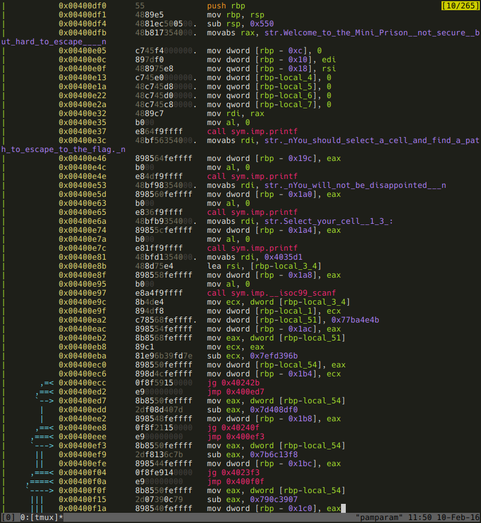

It's pretty clear: we are asked to choose a prison cell (1, 2 or 3), and urged
to find a path out of the prison to the flag. The program also informs us that
we won't be disappointed. Well, I wasn't :)

After this initialization part, all hell breaks loose: there's a lot, and I mean
**A LOT** basic blocks that look very similar:

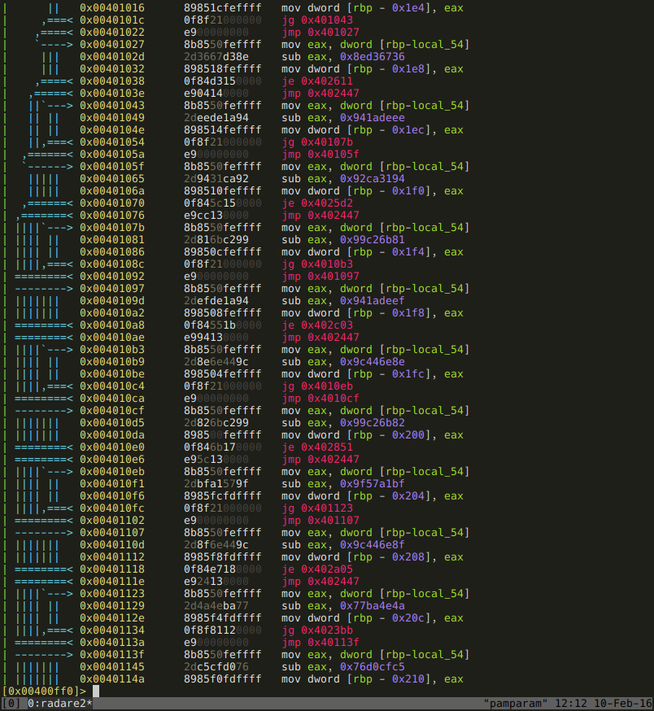

There seems to be two types of them. This:

```
mov eax, dword [rbp-local_54]
sub eax, <some dword>
mov <somewhere on the stack>, eax
jg <some location>
jmp <next instruction>
```

and this:

```
mov eax, dword [rbp-local_54]
sub eax, <some dword>
mov <somewhere on the stack>, eax
je <some location>
jmp 0x402447
```

At 0x402447 there is only a `jmp 0x40340c`, and the je instructions jump to 
basic blocks that do something, and jump to 0x0040340c. At 0x40340c there is
a jump that brings us back to near the beginning. So the program compares some
value (let's call it *control*) with dwords, until a match is found, than runs
the basic block corresponding to that particular *control*. This basic block
does its thing and than gives another value to *control*, and the whole
comparing thing starts again.

If you think about it, this looks like a combination of two obfuscation
techniques:

 - First one is Control Flow Flattening ([Obfuscating C++ programs via control flow flattening](http://ac.inf.elte.hu/Vol_030_2009/003.pdf).
 - Next one is un-flattening that control flow by replacing a single switch
   with a series of comparisons and conditional jumps.

So, to fully understand this program, we need to reverse the basic blocks that
are the destinations of the *je* jumps, and we also need to reconstruct the
control flow. And we've only seen the main function so far, who knows, what lies
down the rabbit hole...

<p align="center"></p>

The thing is, I love reversing, and wouldn't be much of a stripper anyways, so
I'll just go on with this stuff. But I will cheat. I will cheat by using some
assumptions that were made based on contextual information - just read along,
you'll see :)

.follow_the_money
-----------------

I could follow the code and reverse the whole thing, but I can also follow the
mo.. err.. the flag. As I learned from Lena in my first days of cracking
software, looking for the goodboy/badboy locations always pays its prize. The
strings in this executable:

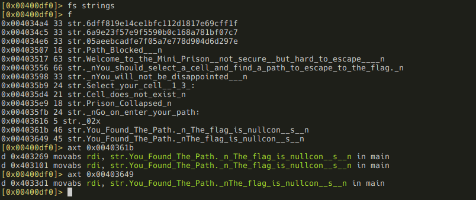

Well, well, well, there it is. Or I should rather say there they are, since
there are not one, but 3 goodboys.

Also, there are 3 strings that look like some hashes (maybe MD5?). The first two
reverse engineering challenges from this CTF also used hardcoded MD5 hashes to 
check the solution - maybe this one does too? This also suggests that the
crackmes were written by the same person. And I was also pretty sure about that
person's name: donfos. He was a
[speaker at the conf](http://nullcon.net/website/nullcon-2016/speakers/aravind-machiry.php),
his name appears on the CTF's  [thank you page](ctf.nullcon.net/madprops.php),
and the title of the 3rd reversing challenge is donfos. This will be important 
later, btw. 

Back to the binary after this little OSINT session. Remember, in the beginning
we are offered to choose a prison cell \- from 3 possible values. Coincidence? I 
don't think so. It looks like there is 3 different paths for the 3 prison cells.

OK, where are these strings used?

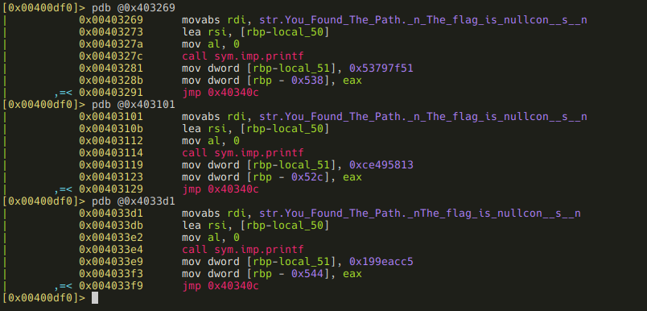

Now we know that the correct flag is placed into `local_50`. Where is it used?
Correct me if I'm wrong, but I think radare2 is not able to do XREFS on local
variables. But there is an ugly workaround:

 - grep for the variable name in the function's disassembly.
 - grep for the local variable's displacement value from the stack base address
   (this is necessery because r2 seems not to recognize local variables when
   they are used in instructions with SIB addressing)

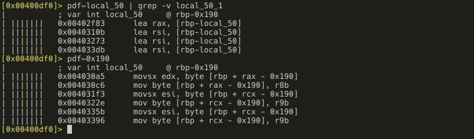

Of course there could be some other place in the binary where this array is
written using some indirect addressing, etc., but we will just ignore that
possibility for now, and hope its not the case.

OK, we've already seen 0x0040310b, 0x00403273 and 0x004044db, let's see the
remaining ones!

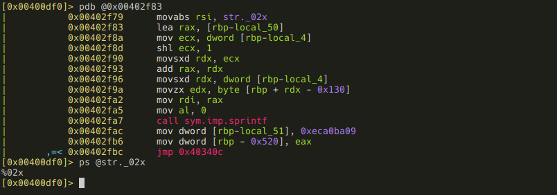

This BB essentially does the following:

```
sprintf(local_50[2 * local_4], "%02x", local_38[local_4])
```

In English: the byte array at `local_38` is hexdumped into `local_50`. To be 
completely fair, this is only an assumption, because we don't know anything 
about `local_4` at this point. But it certainly looks like it's a loop
variable, so I'll treat it as such. OK, what is `local_38`?

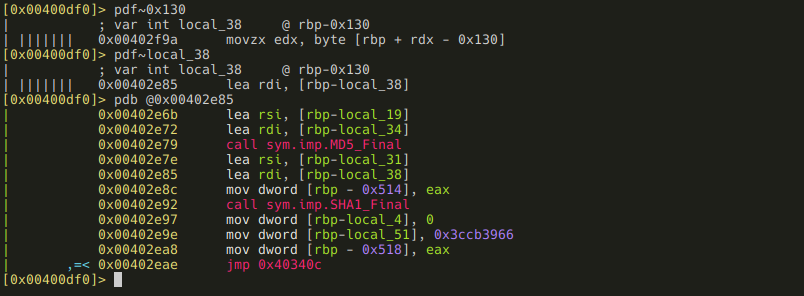

It is used only at one other part of the code: something's SHA1 hash is put into
it. But an SHA1 hash would make an ugly flag, that does not even remotely
resemble the other RE challenge flags from this CTF. So this hash is probably
modified somehow. Remember, we have 6 more locations where `local_50` is
accessed, let's take a look at them!

### .ugly_ass_xors

Those 6 remaining locations are covered by 3 basic blocks that - as the title
kinda spoilers it - are just nicely obfuscated xors. 

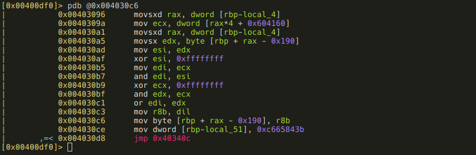

Pseudo-code for this:

```
(0x604160[local_4] & ~local_50[local_4]) | (local_50[local_4] & ~0x604160[local_4])
```

It's basically `(a & ~b) | (b & ~a)`, which is equal to `a ^ b`. So this one
xors `local_50` with the array at 0x604160. Yes, yes, yes, I made the same
assumption here that I made at the sprintf: I treated `local_4` as a loop 
variable.

Second one:

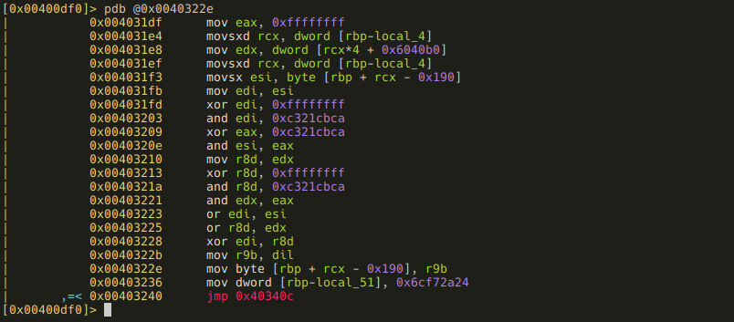

```
((~local_50[local_4] & 0xca) | (local_50[local_4] & ~0xca)) ^ 
((~0x6040b0[local_4] & 0xca) |  (0x6040b0[local_4] & ~0xca))
```

This one looks a bit more complex, but it's still the same: `((~a & 0xca) | (a
& ~0xca)) ^ ((~b & 0xca) | (b & ~0xca))` which is equal to
`(a ^ 0xca) ^ (b ^ 0xca)`, which in turn equals to `a ^ b`. So this xors
`local_50` with the array at 0x006040b0. The last one:

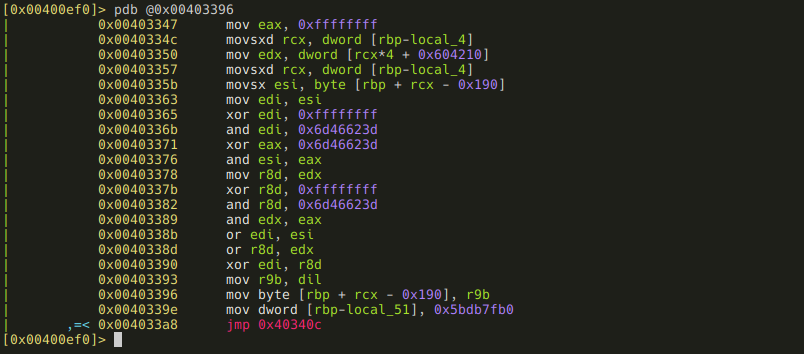

```
((~local_50[local_4] & 0x3d) | (local_50[local_4] & ~0x3d)) ^ 
((~0x604210[local_4] & 0x3d) |  (0x604210[local_4] & ~0x3d))
```

Same as the previous, it just xors with the array at 0x604210.

The three arrays:

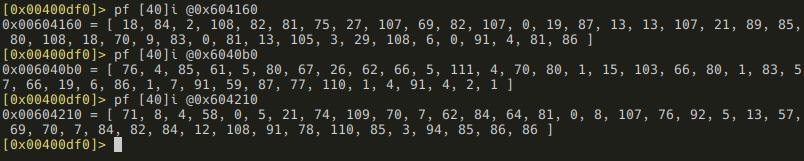

As you can see, I made another assumption (quite a lot of those in this writeup,
but if you think about it, they are more like educated guesses, rather than pure
hunches): the array length is 40. Well, an SHA1 hash is 40 characters long in
hex format, and all the numbers from array[0] to array[39] fit in one byte, but
array[40] does not, for all three arrays. So those 40-byte arrays just fit there
nicely.

.solution
---------

### .theory

A summary of the things we know (or suspect) about this executable:

 - The flag is stored in `local_50`
 - `local_50` is written at four locations:
   - A hex representation of some SHA1 hash is put into it.
   - It is xored with the array at 0x604160.
   - It is xored with the array at 0x6040b0.
   - It is xored with the array at 0x604210.
 - There is probably 3 different paths for the three initial prison cells.

Based on the theory that there are 3 different good solutions, we can speculate
that on each run, only one of those xoring-with-hardcoded-array code paths is
executed: each initial prison cell has a corresponding hardcoded array. And the 
xoring has to take place after writing the hex SHA1 hash, not the other way
around, since before that, `local_50` is uninitialized. 

To summarize the summary:

 - array(0x604160) xor hex(sha1(path1)) = flag
 - array(0x6040b0) xor hex(sha1(path2)) = flag
 - array(0x604210) xor hex(sha1(path3)) = flag

The flags for all the other RE challenges were English sentences in lowercase
leetspeak, using '\_' as word separator. So, here's the plan:

We xor each byte from an array with all the possible hex characters
("0123456789abcdef" - lowercase, because the format string was "%02x"), and keep
the ones that are valid flag characters (lowercase letters + the leet digits +
'\_'). This way we get an array of possible characters for each position of the
flag. Hopefully there will be positions where '\_' is part of the possible
character array. We will consider those as word separator positions.

If we unleetspeak these characters, we can start searching for words that
are built up using those characters. For example, consider the following:

 - possible characters for 1st position: "hb"
 - possible characters for 2nd position: "a4x"
 - possible characters for 3rd position: "act"
 - possible characters for 4th position: "01kyz"

The above characters unleetspeaked: "hb", "ax", "act", "oikyz". This yields the
words "hack" and "back", so the original words could've been "hack", "back",
"h4ck", or "b4ck". 

My first thought was that I'll unleetspeak the possible characters, generate all
combinations, and see if the resulting string is a English word by looking it up
in wordlists. Well, that's universally stupid, man! I was tired, but quickly 
realized checking all combinations easily could take forever. 

Than I started thinking about writing a letter-by-letter search in my wordlists,
but it came to me that it's also stupid: that's what we have regexes for! So,
for the above example, the regex `^[hb][ax][act][oikyz]$` could be matched
against my wordlists, and the results are candidates for the word.

If we do this using only one of the hardcoded arrays, there will be a lot of
words for each word positions, which makes selecting the correct ones hard (or
maybe impossible). What we can do is generate the possible characters for each
positions for all three arrays, and take their intersection. Hopefully this
yields a much friendlier result.

A few words about wordlists: as you may have realized, I used the plural form of
the word. I work as a pentester, and I tend to create a customized wordlist
during the recon phase of each engagement based on e.g. company name, executive
names, etc., you get the idea. Btw, this is pretty common, there are even tools
for this (e.g. [CeWL](https://digi.ninja/projects/cewl.php)). Of course I
combine this with more general wordlists (for English words I often use the
[Corncob list](http://www.mieliestronk.com/wordlist.html)), but the customized
is always the first one checked. I'm telling you this, because I did the same
here, and turned out it was necessery :)

### .practice

OK, the [Python code](jailbreak-bruteforce.py) I wrote gave the following output:

```
==== WORD ====
possible characters: ['t', '10', 'agf10347']
---- recon ----
---- corncob ----
tie: ['t13']
tit: ['t17']
toe: ['t03']
tog: ['t0g']
too: ['t00']
tot: ['t07']

==== WORD ====
possible characters: ['acdf10347', 'acdgf354', 's', 'yx']
---- recon ----
---- corncob ----
easy: ['3asy', '34sy']

==== WORD ====
possible characters: ['qpsrutwv', 'acdf10347']
---- recon ----
re: ['r3']
---- corncob ----
pa: ['pa', 'p4']
pi: ['p1']
re: ['r3']
so: ['s0']
to: ['t0']
we: ['w3']

==== WORD ====
possible characters: ['abef1057', 'qpruwv', 'acbedgf354', '954', 'i9kln']
---- recon ----
break: ['bre4k', 'br34k']
---- corncob ----
areal: ['are4l', 'ar34l']
break: ['bre4k', 'br34k']
freak: ['fre4k', 'fr34k']
fugal: ['fug4l']
organ: ['0rg4n']
speak: ['5pe4k', '5p34k']
sudan: ['5ud4n']
tweak: ['7we4k', '7w34k']

==== WORD ====
possible characters: ['t', 'ih', 'cdg10347', '5']
---- recon ----
---- corncob ----
this: ['th15']
tics: ['tic5']
ties: ['ti35']
tits: ['ti75']

==== WORD ====
possible characters: ['qpstwv', 'qpruwv', '10', 'acbedgf057', 'cbed10347',
'acbedf057', 'ih9on']
---- recon ----
---- corncob ----
protean: ['pr07ean', 'pr073an']
quieten: ['qu1e7en']
tristan: ['tr157an']
trodden: ['tr0dden']
tuition: ['tu1710n']
written: ['wr177en']

==== WORD ====
possible characters: ['b', 'yx']
---- recon ----
---- corncob ----
by: ['by']

==== WORD ====
possible characters: ['cbedg10347', 'abef103547', 'ihkjmlon', 'abegf10347', 'acdgf03547', 'cbedg03547']
---- recon ----
donfos: ['d0nf05']
---- corncob ----
abject: ['4bjec7', '4bj3c7']
ablate: ['4bla7e', '4bla73', '4bl47e', '4bl473']
ablest: ['4ble57', '4bl357']
afloat: ['4fl0a7', '4fl047']
baited: ['bai73d', 'b4i73d']
bamboo: ['bamb00', 'b4mb00']
banged: ['bang3d', 'b4ng3d']
baobab: ['baobab', 'baob4b', 'b4obab', 'b4ob4b']
behead: ['behead', 'behe4d', 'beh3ad', 'beh34d', 'b3head', 'b3he4d', 'b3h3ad', 'b3h34d']
behest: ['behe57', 'beh357', 'b3he57', 'b3h357']
belied: ['bel13d', 'b3l13d']
belies: ['bel135', 'b3l135']
belted: ['bel73d', 'b3l73d']
bilges: ['b1lg35']
bolted: ['b0l73d']
bombed: ['b0mb3d']
booboo: ['b0ob00']
booted: ['b0o73d']
calico: ['cal1c0', 'c4l1c0']
canada: ['canad4', 'can4d4', 'c4nad4', 'c4n4d4']
canoed: ['can03d', 'c4n03d']
canoes: ['can035', 'c4n035']
canted: ['can73d', 'c4n73d']
combat: ['c0mba7', 'c0mb47']
combed: ['c0mb3d']
comets: ['c0me75', 'c0m375']
comics: ['c0m1c5']
conics: ['c0n1c5']
damage: ['damage', 'damag3', 'dam4ge', 'dam4g3', 'd4mage', 'd4mag3', 'd4m4ge', 'd4m4g3']
deject: ['dejec7', 'dej3c7', 'd3jec7', 'd3j3c7']
delate: ['dela7e', 'dela73', 'del47e', 'del473', 'd3la7e', 'd3la73', 'd3l47e', 'd3l473']
delete: ['dele7e', 'dele73', 'del37e', 'del373', 'd3le7e', 'd3le73', 'd3l37e', 'd3l373']
delict: ['del1c7', 'd3l1c7']
deltas: ['del7a5', 'del745', 'd3l7a5', 'd3l745']
demise: ['dem15e', 'dem153', 'd3m15e', 'd3m153']
demist: ['dem157', 'd3m157']
demote: ['dem07e', 'dem073', 'd3m07e', 'd3m073']
denied: ['den13d', 'd3n13d']
denies: ['den135', 'd3n135']
denote: ['den07e', 'den073', 'd3n07e', 'd3n073']
dented: ['den73d', 'd3n73d']
diktat: ['d1k7a7', 'd1k747']
dilate: ['d1la7e', 'd1la73', 'd1l47e', 'd1l473']
dinged: ['d1ng3d']
donate: ['d0na7e', 'd0na73', 'd0n47e', 'd0n473']
ethics: ['e7h1c5', '37h1c5']
gamete: ['game7e', 'game73', 'gam37e', 'gam373', 'g4me7e', 'g4me73', 'g4m37e', 'g4m373']
ganged: ['gang3d', 'g4ng3d']
ganges: ['gang35', 'g4ng35']
genets: ['gene75', 'gen375', 'g3ne75', 'g3n375']
gonads: ['g0nad5', 'g0n4d5']
goofed: ['g0of3d']
ionise: ['10n15e', '10n153']
islets: ['15le75', '15l375']
object: ['0bjec7', '0bj3c7']
oblate: ['0bla7e', '0bla73', '0bl47e', '0bl473']
oblige: ['0bl1ge', '0bl1g3']
oboist: ['0bo157']
tamest: ['7ame57', '7am357', '74me57', '74m357']
tenets: ['7ene75', '7en375', '73ne75', '73n375']
tented: ['7en73d', '73n73d']
tilted: ['71l73d']
tinged: ['71ng3d']
tinges: ['71ng35']
tinted: ['71n73d']
toledo: ['70led0', '70l3d0']
tomato: ['70ma70', '70m470']
tonics: ['70n1c5']
tooted: ['70o73d']
```

This is basically a list of word candidates with the re-leetspeaked versions
listed too. It's not too hard to (almost) put together a sentence that makes
sense: 

> too easy to break this ??????? by donfos

The problem is, none of the candidates for the 6th word fit. Given the context,
"prison" would be perfect, but that's one character short. Remember, the whole
flag has to be 40 characters, since its a morphed hex representation of an SHA1
hash. So maybe it **is** "prison", but with some additional characters? I could
put together two candidates: "pr1500n" and "pr1510n".

So, we end up with these possible flags:

 - t00\_3asy\_t0\_bre4k\_th15\_pr1500n\_by\_d0nf05
 - t00\_34sy\_t0\_bre4k\_th15\_pr1500n\_by\_d0nf05
 - t00\_3asy\_t0\_br34k\_th15\_pr1500n\_by\_d0nf05
 - t00\_34sy\_t0\_br34k\_th15\_pr1500n\_by\_d0nf05
 - t00\_3asy\_t0\_bre4k\_th15\_pr1510n\_by\_d0nf05
 - r00\_34sy\_t0\_bre4k\_th15\_pr1510n\_by\_d0nf05
 - t00\_3asy\_t0\_br34k\_th15\_pr1510n\_by\_d0nf05
 - t00\_34sy\_t0\_br34k\_th15\_pr1510n\_by\_d0nf05

Yeah, it's not an exact solution, but trying 8 candidates is not impossible, I
think :)

.outro
------

We know very little about how the executable works, for example, we actually
don't know how the solution is checked - basically we don't know the path out of
the prison. Yet, we have a pretty good idea of the flag! :)

Of course I got lucky, this whole attempt could've easily ended up as an utter
failure (as did my similar approach for Pseudorandom), but there is an important
takeaway here: don't rely *solely* on hard facts, dare to make assumptions, and
follow your gut feelings! In other words: be lazy, maybe it'll work out :D

P.S.: I also wanted to properly reverse the whole thing, so I did that too with
the help of r2pipe and Graphviz. There will be a writeup for that too, but for
now you'll have to settle with the 
[reconstructed control flow graph of the main function](../proper/jailbreak-plans.dot.png),
and the [Python code that generates it](../proper/jailbreak.py).
